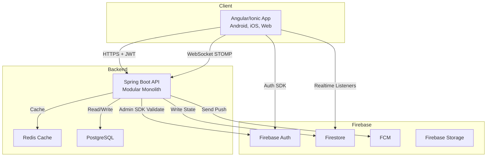
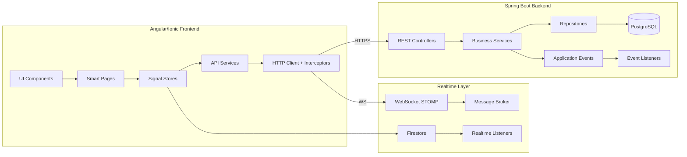
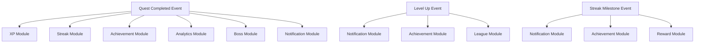
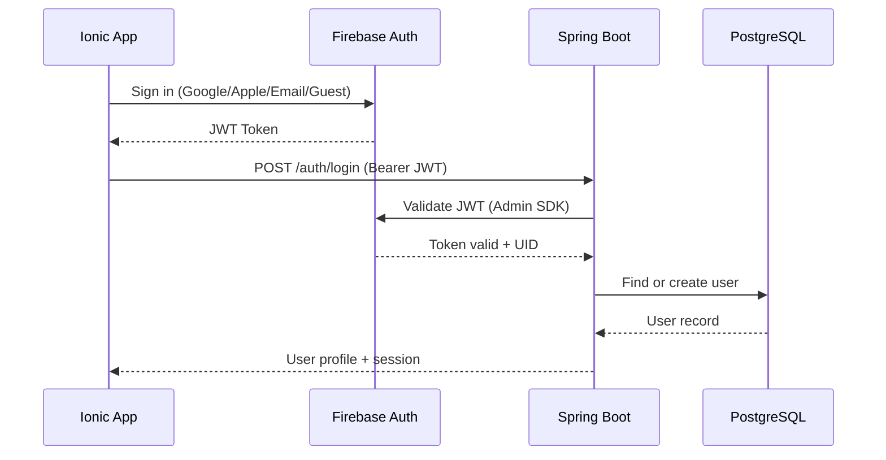

# Design Document: Ascend App

## Overview

Ascend is a game-first self-improvement platform that transforms personal growth into an immersive RPG experience. The system architecture follows a hybrid approach: an Angular/Ionic mobile-first frontend communicates with a Spring Boot modular monolith backend, using Firebase as the identity and realtime layer, PostgreSQL for business logic and analytics, and Redis for caching hot data.

The design prioritizes:
- **Server-authoritative gameplay**: All XP, streak, and reward calculations happen server-side to prevent cheating
- **Event-driven module communication**: Spring Application Events decouple modules for independent testability
- **Optimistic UI with server validation**: Firestore provides instant feedback while Spring Boot validates and persists
- **Offline-first mobile experience**: Local queue with server-wins conflict resolution

### System Context Diagram



## Architecture

### High-Level Architecture

The system uses a **Clean Architecture + Modular Monolith** pattern on the backend and a **Feature-First (Domain-Driven)** architecture on the frontend.



### Backend Module Architecture

Each domain module follows a consistent layered structure:

```
{module}/
├── controller/      — REST endpoints
├── service/         — Business logic
├── repository/      — Data access (JPA)
├── entity/          — Database entities
├── dto/             — Request/Response objects
├── mapper/          — Entity ↔ DTO conversion
├── validator/       — Input validation
├── event/           — Domain events
└── scheduler/       — Scheduled tasks (where applicable)
```

### Event-Driven Communication

Modules communicate via Spring Application Events to avoid tight coupling:



### Frontend Architecture

- **Standalone Components** (no NgModules)
- **Angular Signals** for reactive state management
- **Lazy-loaded feature routes** for performance
- **Smart/Dumb component pattern**: Pages orchestrate, components render
- **Interceptor chain**: Auth → Error → Loading → Retry

### Authentication Flow



### Caching Strategy

| Data | Cache Location | TTL | Invalidation |
|------|---------------|-----|--------------|
| Leaderboard rankings | Redis | 5 min | On league cycle end |
| User stats summary | Redis | 10 min | On XP award |
| Active arc state | Redis | 15 min | On milestone completion |
| Quest templates | Redis | 30 min | On admin update |
| Profile data | Redis | 10 min | On profile update |

### WebSocket Architecture

Spring WebSocket with STOMP protocol over SockJS:

| Channel Pattern | Purpose | Example |
|----------------|---------|---------|
| `/topic/guild/{id}/chat` | Guild broadcast | Chat messages |
| `/topic/leaderboard/{league}` | League broadcast | Rank updates |
| `/user/{id}/queue/xp` | Private XP updates | XP gained |
| `/user/{id}/queue/level` | Private level-up | Level notifications |
| `/user/{id}/queue/streak` | Private streak alerts | Streak warnings |
| `/user/{id}/queue/boss` | Private boss progress | Boss damage |
| `/user/{id}/queue/notifications` | Private notifications | Rewards, alerts |

## Components and Interfaces

### Backend Modules

#### Auth Module
- **FirebaseTokenFilter**: Security filter validating JWT on every request
- **AuthController**: Login endpoint, token exchange
- **AuthService**: User session creation, role resolution
- **SecurityConfig**: RBAC rules, CORS, rate limiting

#### Quest Module
- **QuestController**: CRUD + completion endpoints
- **QuestService**: Quest assignment, validation
- **QuestCompletionService**: Completion processing, event publishing
- **QuestValidator**: Input validation (title, difficulty, XP range)
- **QuestResetScheduler**: Daily reset at user local midnight

#### XP Module
- **XpCalculator**: Pure function implementing `FinalXP = BaseXP × DifficultyMultiplier × StreakMultiplier × ArcMultiplier + BonusXP`
- **LevelCalculator**: Pure function implementing `XP_Required = 100 × Level^1.5`
- **XpService**: Orchestrates XP award, cap enforcement, history logging
- **LevelService**: Level-up detection, reward distribution

#### Streak Module
- **StreakService**: Streak increment/reset logic, shield activation
- **StreakCalculationScheduler**: End-of-day streak evaluation
- **ComboCalculator**: Pure function `ComboMultiplier = 1 + (0.01 × StreakDays)` capped at 2x

#### Arc Module
- **ArcService**: Arc catalog, start/stop
- **ArcProgressService**: Milestone tracking, phase transitions
- **ArcRecommendationEngine**: Personality-based Arc matching

#### League Module
- **LeagueService**: Tier assignment, score calculation
- **MatchmakingService**: Group users by skill level
- **LeagueResetScheduler**: Weekly promotion/demotion cycle

#### Guild Module
- **GuildService**: CRUD, membership, shared quests
- **GuildChatHandler**: WebSocket message handler
- **GuildRankingService**: Guild leaderboard calculation

#### Boss Module
- **BossService**: Progress tracking, stage management, defeat rewards
- **BossProgressCalculator**: Damage calculation from quest completions

#### Skill Tree Module
- **SkillTreeService**: Prerequisite validation, unlock, buff application
- **SkillBuffCalculator**: `BoostedXP = BaseXP × (1 + SkillBoost)`

#### AI Coach Module
- **AiCoachService**: Recommendation generation
- **BurnoutDetectionService**: Risk calculation and Recovery Mode activation
- **AdaptiveDifficultyService**: Performance-based difficulty adjustment

#### Notification Module
- **NotificationService**: Orchestration, daily cap enforcement
- **FcmService**: Firebase Cloud Messaging integration
- **NotificationScheduler**: Optimal timing, streak alerts

#### Premium Module
- **SubscriptionService**: Tier management, trial, downgrade
- **FeatureGateService**: Premium feature access control

#### Analytics Module
- **AnalyticsService**: Dashboard data aggregation
- **LifeScoreService**: Life Score calculation
- **WeeklyReportService**: Sunday report generation
- **CorrelationService**: Habit correlation detection

#### Admin Module
- **AdminService**: Arc/Quest CMS operations
- **ModerationService**: User moderation actions
- **EventService**: Seasonal event management

### Frontend Feature Modules

| Module | Key Components | State Store |
|--------|---------------|-------------|
| Auth | LoginPage, SignupPage | - |
| Onboarding | WelcomePage, GoalSelection, DifficultySelection, Assessment, ArcRecommendation | - |
| Dashboard | DashboardPage, XpCard, StreakCard, QuestList, ActiveArc | UserStore, QuestStore |
| Quests | QuestBoard, QuestDetail, QuestCreate, QuestComplete | QuestStore |
| Leveling | LevelUpPage, XpAnimation, LevelRewards | XpStore |
| Streaks | StreakDetail, StreakCounter, ComboDisplay, ComebackModal | StreakStore |
| Arc Mode | ArcList, ArcDetail, ArcProgress, MilestoneTimeline, SkillTreePreview | ArcStore |
| Guilds | GuildList, GuildDetail, GuildCreate, GuildChat | GuildStore |
| Leagues | Leaderboard, LeagueBadge, RankCard, PromotionModal | - |
| Boss Battle | BossList, BossFight, BossHpBar, BossReward | - |
| Analytics | AnalyticsDashboard, Heatmap, WeeklyChart, StatTrends, LifeScore | - |
| AI Coach | CoachDashboard, SuggestionCard, InsightWidget | - |
| Premium | Subscription, Benefits | - |
| Social | Friends, Challenges, Feed | - |
| Profile | ProfileView, ProfileEdit, StatsRadar, AchievementList | UserStore |

### API Interface Summary

**Base URL**: `/api/v1/`
**Auth**: `Authorization: Bearer {firebase_jwt_token}`

| Endpoint | Method | Purpose |
|----------|--------|---------|
| `/auth/login` | POST | Token exchange, session creation |
| `/auth/me` | GET | Current user profile |
| `/dashboard` | GET | Complete dashboard data |
| `/quests/daily` | GET | Today's quests |
| `/quests/complete` | POST | Complete a quest |
| `/quests` | POST | Create custom quest |
| `/xp/summary` | GET | XP and level summary |
| `/xp/history` | GET | XP transaction history |
| `/streak` | GET | Current streak info |
| `/arcs` | GET | Available arcs |
| `/arcs/start` | POST | Start an arc |
| `/arcs/progress` | GET/PATCH | Arc progress |
| `/league/leaderboard` | GET | League rankings |
| `/guilds` | POST | Create guild |
| `/guilds/{id}/join` | POST | Join guild |
| `/skills/tree` | GET | Skill tree state |
| `/skills/unlock` | POST | Unlock skill node |
| `/boss/{id}` | GET | Boss details |
| `/analytics/weekly` | GET | Weekly report |
| `/analytics/life-score` | GET | Life score |
| `/premium/status` | GET | Subscription status |
| `/notifications` | GET | User notifications |

**Response Format**:
```json
{
  "success": true,
  "message": "Operation successful",
  "data": {}
}
```

## Data Models

### PostgreSQL Schema

#### Core Entities

```mermaid
erDiagram
    USERS ||--o{ QUEST_COMPLETION : completes
    USERS ||--o| STREAKS : has
    USERS ||--o| USER_STATS : has
    USERS ||--o{ XP_HISTORY : earns
    USERS ||--o{ USER_ARC_PROGRESS : progresses
    USERS ||--o{ USER_SKILLS : unlocks
    USERS ||--o{ ACHIEVEMENTS : earns
    USERS ||--o{ GUILD_MEMBERS : joins
    USERS ||--o| LEADERBOARD : ranks
    USERS ||--o| SUBSCRIPTIONS : subscribes

    QUESTS ||--o{ QUEST_COMPLETION : completed_by
    ARCS ||--o{ ARC_MILESTONES : contains
    ARCS ||--o{ USER_ARC_PROGRESS : tracked_by
    GUILDS ||--o{ GUILD_MEMBERS : has
    GUILDS ||--o{ GUILD_CHALLENGES : runs

    USERS {
        uuid id PK
        varchar firebase_uid UK
        varchar username UK
        varchar email UK
        text avatar_url
        int level
        bigint xp
        varchar league
        boolean premium
        boolean hard_mode
        varchar timezone
        timestamp created_at
        timestamp updated_at
    }

    QUESTS {
        uuid id PK
        varchar title
        text description
        varchar difficulty
        int xp_reward
        varchar stat_type
        varchar frequency
        boolean recurring
        uuid arc_id FK
        uuid created_by FK
        boolean is_custom
        timestamp created_at
    }

    QUEST_COMPLETION {
        uuid id PK
        uuid user_id FK
        uuid quest_id FK
        timestamp completed_at
        int xp_earned
        decimal multiplier
        varchar difficulty_at_completion
    }

    XP_HISTORY {
        uuid id PK
        uuid user_id FK
        varchar source_type
        uuid source_id
        int xp_amount
        decimal multiplier
        varchar stat_type
        timestamp created_at
    }

    STREAKS {
        uuid id PK
        uuid user_id FK
        int current_streak
        int longest_streak
        decimal combo_multiplier
        timestamp last_completed_at
        boolean shield_available
        timestamp shield_used_at
        timestamp updated_at
    }

    USER_STATS {
        uuid id PK
        uuid user_id FK
        int strength
        int wisdom
        int focus
        int discipline
        int vitality
        int charisma
        decimal life_score
        timestamp updated_at
    }

    ARCS {
        uuid id PK
        varchar name
        text description
        varchar type
        varchar difficulty
        int duration_days
        boolean is_prebuilt
        timestamp created_at
    }

    ARC_MILESTONES {
        uuid id PK
        uuid arc_id FK
        varchar title
        text description
        int order_index
        int xp_reward
    }

    USER_ARC_PROGRESS {
        uuid id PK
        uuid user_id FK
        uuid arc_id FK
        int progress_percent
        int current_phase
        timestamp started_at
        timestamp completed_at
        varchar status
    }

    USER_SKILLS {
        uuid id PK
        uuid user_id FK
        uuid skill_id
        varchar skill_name
        uuid arc_id FK
        boolean unlocked
        timestamp unlocked_at
    }

    GUILDS {
        uuid id PK
        varchar name UK
        text description
        uuid owner_id FK
        varchar type
        int max_members
        bigint guild_xp
        timestamp created_at
    }

    GUILD_MEMBERS {
        uuid id PK
        uuid guild_id FK
        uuid user_id FK
        varchar role
        timestamp joined_at
    }

    LEADERBOARD {
        uuid id PK
        uuid user_id FK
        bigint weekly_xp
        int weekly_rank
        int global_rank
        varchar league
        decimal consistency_score
        varchar season_id
        timestamp updated_at
    }

    BOSS_PROGRESS {
        uuid id PK
        uuid user_id FK
        uuid boss_id
        varchar boss_name
        int current_stage
        int progress_percent
        boolean defeated
        timestamp defeated_at
    }

    ACHIEVEMENTS {
        uuid id PK
        uuid user_id FK
        varchar achievement_name
        varchar achievement_type
        text description
        timestamp unlocked_at
    }

    SUBSCRIPTIONS {
        uuid id PK
        uuid user_id FK
        varchar provider
        varchar plan_type
        boolean premium
        timestamp started_at
        timestamp expires_at
        boolean auto_renew
    }

    GUILD_CHALLENGES {
        uuid id PK
        uuid guild_id FK
        varchar title
        int target
        int current_progress
        timestamp created_at
        timestamp ends_at
    }

    NOTIFICATIONS_LOG {
        uuid id PK
        uuid user_id FK
        varchar type
        varchar title
        text message
        timestamp sent_at
        timestamp read_at
    }
```



#### Key Constraints

- `UNIQUE(user_id, quest_id, completed_at::date)` on quest_completion — prevents duplicate daily completions
- `UNIQUE(user_id, arc_id)` on user_arc_progress — one active progress per arc
- `UNIQUE(guild_id, user_id)` on guild_members — no duplicate memberships
- `UNIQUE(user_id, skill_id)` on user_skills — no duplicate skill unlocks
- `UNIQUE(user_id, boss_id)` on boss_progress — one progress per boss

#### Indexing Strategy

```sql
-- User lookups
CREATE INDEX idx_users_firebase_uid ON users(firebase_uid);
CREATE INDEX idx_users_level_xp ON users(level DESC, xp DESC);

-- Quest completion queries
CREATE INDEX idx_quest_completion_user ON quest_completion(user_id);
CREATE INDEX idx_quest_completion_date ON quest_completion(completed_at);

-- Leaderboard performance
CREATE INDEX idx_leaderboard_league ON leaderboard(league);
CREATE INDEX idx_leaderboard_rank ON leaderboard(weekly_rank);
CREATE INDEX idx_leaderboard_xp ON leaderboard(weekly_xp DESC);

-- Streak lookups
CREATE INDEX idx_streaks_user ON streaks(user_id);

-- XP history
CREATE INDEX idx_xp_history_user ON xp_history(user_id);
CREATE INDEX idx_xp_history_date ON xp_history(created_at);

-- Guild members
CREATE INDEX idx_guild_members_user ON guild_members(user_id);
CREATE INDEX idx_guild_members_guild ON guild_members(guild_id);
```

### Firestore Schema (Realtime Layer)

Firestore stores lightweight, realtime UX data — not core business logic.

| Collection | Purpose | Sync Direction |
|-----------|---------|----------------|
| `users` | Profile cache for realtime display | Backend → Firestore |
| `quest-progress` | Optimistic quest state | App → Firestore → Backend validates |
| `guild-chat` | Real-time chat messages | App → Firestore (+ WebSocket) |
| `presence` | Online/offline status | App → Firestore |
| `live-notifications` | In-app notification feed | Backend → Firestore |
| `leaderboard-cache` | Cached rankings for instant display | Backend → Firestore (read-only for clients) |
| `realtime-progress` | Live quest/arc progress | App → Firestore |

### Domain Events

| Event | Published By | Consumed By |
|-------|-------------|-------------|
| `QuestCompletedEvent` | Quest Module | XP, Streak, Achievement, Analytics, Boss, Notification |
| `XpAwardedEvent` | XP Module | Leaderboard, Analytics |
| `LevelUpEvent` | Level Service | Notification, Achievement, League |
| `StreakMilestoneEvent` | Streak Module | Notification, Achievement, Reward |
| `StreakBrokenEvent` | Streak Module | Notification, Comeback |
| `ArcPhaseCompleteEvent` | Arc Module | Notification, Achievement, Boss |
| `BossDefeatedEvent` | Boss Module | Notification, Achievement, Reward |
| `GuildChallengeCompleteEvent` | Guild Module | Notification, Guild Ranking |
| `AchievementUnlockedEvent` | Achievement Module | Notification, Profile |


## Correctness Properties

*A property is a characteristic or behavior that should hold true across all valid executions of a system — essentially, a formal statement about what the system should do. Properties serve as the bridge between human-readable specifications and machine-verifiable correctness guarantees.*

### Property 1: XP Calculation Formula Correctness

*For any* valid quest completion with BaseXP > 0, DifficultyMultiplier ∈ {1, 1.5, 2, 3}, StreakMultiplier ∈ [1, 2], ArcMultiplier ≥ 1, and BonusXP ≥ 0, the XP Engine SHALL compute FinalXP = BaseXP × DifficultyMultiplier × StreakMultiplier × ArcMultiplier + BonusXP.

**Validates: Requirements 5.1, 5.2**

### Property 2: Combo Multiplier with Cap

*For any* non-negative streak day count, the combo multiplier SHALL equal min(1 + 0.01 × StreakDays, 2.0), ensuring the multiplier never exceeds 2x regardless of streak length.

**Validates: Requirements 5.3, 7.6**

### Property 3: Daily XP Cap Enforcement

*For any* user at level L with daily XP earned so far, the system SHALL not award XP that would cause the daily total to exceed 1000 + (L × 20). Any excess XP SHALL be discarded.

**Validates: Requirements 5.4**

### Property 4: Server-Side XP Authority

*For any* API request containing client-submitted XP values, the XP Engine SHALL reject the client values and calculate XP exclusively from server-side quest completion data.

**Validates: Requirements 5.5**

### Property 5: Perfect Day Bonus

*For any* user who completes all assigned daily missions in a single day, the XP Engine SHALL award exactly 100 bonus XP plus a chest unlock, in addition to individual quest rewards.

**Validates: Requirements 5.6**

### Property 6: XP Transaction Audit Trail

*For any* XP award event, the system SHALL create an xp_history record containing source_type, source_id, xp_amount, multiplier, and stat_type, such that the sum of all xp_history records for a user equals their total XP.

**Validates: Requirements 5.7**

### Property 7: Level Progression Formula

*For any* level L ≥ 1, the XP required to reach level L SHALL equal ⌊100 × L^1.5⌋, and for any user with total XP, their level SHALL be the highest L where cumulative XP requirement ≤ total XP.

**Validates: Requirements 6.1, 6.2**

### Property 8: Prestige XP Bonus

*For any* user with PrestigeLevel ≥ 1, all XP awards SHALL be multiplied by (1 + 0.1 × PrestigeLevel), compounding with other multipliers.

**Validates: Requirements 6.6**

### Property 9: Streak Tracking Invariant

*For any* sequence of daily quest completions and misses, the current_streak SHALL equal the number of consecutive most-recent days where ≥ 80% of daily quests were completed, and longest_streak SHALL equal the maximum current_streak value ever achieved.

**Validates: Requirements 7.1, 7.5**

### Property 10: Streak Reset Without Shield

*For any* user without an available Streak Shield who fails to complete ≥ 80% of daily quests, the Streak Engine SHALL reset current_streak to zero and activate Comeback Mode.

**Validates: Requirements 7.2**

### Property 11: Comeback Mode Redemption Window

*For any* streak break event, the system SHALL provide a 48-hour redemption window with reduced difficulty quests and recovery XP bonuses, after which the window closes.

**Validates: Requirements 7.3**

### Property 12: Streak Shield Auto-Activation

*For any* user with shield_available = true who misses the daily threshold, the Streak Engine SHALL auto-activate the shield (setting shield_available = false), preserving the current streak without reset.

**Validates: Requirements 7.4**

### Property 13: Quest Completion Idempotency

*For any* (user_id, quest_id, date) tuple, the system SHALL accept at most one completion. Subsequent completion attempts for the same tuple SHALL be rejected, and XP SHALL be awarded exactly once.

**Validates: Requirements 2.2, 4.4, 19.3**

### Property 14: Offline Action Round-Trip

*For any* sequence of quest completions performed offline, when connectivity is restored, all queued actions SHALL be synced to the backend. If the backend validates an action, local state SHALL match server state. If the backend rejects an action, local optimistic state SHALL be rolled back.

**Validates: Requirements 2.3, 21.1, 21.2, 21.3**

### Property 15: Sync Conflict Resolution

*For any* conflict between local state and server state during sync, the server state SHALL win. However, locally queued completions that have not yet been processed by the server SHALL be preserved and submitted for validation.

**Validates: Requirements 2.4**

### Property 16: Arc Recommendation Validity

*For any* combination of user goals, personality assessment answers, and available time, the Arc Engine SHALL produce a recommendation that is a valid Arc from the catalog matching at least one of the user's selected goals.

**Validates: Requirements 3.4**

### Property 17: Quest Response Completeness

*For any* daily quest returned by the API, the response SHALL contain all required fields: id, title, description, xpReward, difficulty, statType, and completed status.

**Validates: Requirements 4.2**

### Property 18: Quest Completion Orchestration

*For any* valid quest completion, the system SHALL: (1) validate the completion server-side, (2) calculate and award XP using the formula, (3) update the relevant character stat, and (4) update the streak counter. All four operations SHALL complete atomically.

**Validates: Requirements 4.3**

### Property 19: Custom Quest Validation

*For any* custom quest creation request, the Quest Engine SHALL reject the request if it lacks a title, difficulty, frequency, stat_type, or if xp_reward is outside the allowed range [10, 300].

**Validates: Requirements 4.6**

### Property 20: Daily Reset by Timezone

*For any* user with a configured timezone, the daily quest reset SHALL occur at exactly 00:00 in that user's local time, resetting all recurring daily quests to incomplete status.

**Validates: Requirements 4.7**

### Property 21: Arc Progress and Phase Transition

*For any* arc milestone completion, the Arc Engine SHALL update progress_percent = (completed_milestones / total_milestones × 100), award milestone XP, and transition to the next phase when the phase threshold is crossed.

**Validates: Requirements 8.3**

### Property 22: Custom Arc Validation

*For any* custom Arc creation request, the Arc Engine SHALL reject the request if it lacks a title, goal, duration (must be 30-90 days), at least one milestone, or quest frequency.

**Validates: Requirements 8.5**

### Property 23: Adaptive Difficulty on Performance Decline

*For any* user whose Arc performance declines (completion rate drops below threshold), the Arc Engine SHALL reduce quest difficulty temporarily rather than failing the Arc. The Arc status SHALL never change to "failed" due to performance decline alone.

**Validates: Requirements 8.6**

### Property 24: Stat Gain Formula

*For any* quest completion with a stat_type, the character stat gain SHALL equal BaseStat × DifficultyMultiplier, where DifficultyMultiplier matches the quest's difficulty level.

**Validates: Requirements 9.2**

### Property 25: Identity Title Unlock at Threshold

*For any* character stat that reaches a defined threshold value, the system SHALL unlock the corresponding identity title. Once unlocked, the title SHALL remain permanently available regardless of future stat changes.

**Validates: Requirements 9.4**

### Property 26: League Tier Assignment

*For any* user at a given level, the League Engine SHALL assign the correct tier: Bronze (default), Silver (Level ≥ 10), Gold (Level ≥ 20), Platinum (Level ≥ 35), Diamond (Level ≥ 50), Master (Level ≥ 75), Ascendant (invite-only).

**Validates: Requirements 10.1**

### Property 27: League Score Formula

*For any* user with level L, consistency C, streak S, and activity score A, the league score SHALL equal 0.4×L + 0.3×C + 0.2×S + 0.1×A.

**Validates: Requirements 10.2**

### Property 28: Weekly Promotion and Demotion

*For any* league group at the end of the weekly cycle, the top 15 users by league score SHALL be promoted to the next tier, and the bottom 15 users SHALL be demoted to the previous tier.

**Validates: Requirements 10.3**

### Property 29: Anti-Cheat Speed Detection

*For any* user activity pattern where more than 10 quests are completed in less than 5 minutes, the Anti-Cheat System SHALL flag the account and apply penalties including XP rollback and leaderboard ban.

**Validates: Requirements 10.5, 19.2**

### Property 30: Guild Creation with Tier Caps

*For any* guild creation request, the Guild Engine SHALL enforce member caps based on subscription tier: Free users get max 10 members, Premium users get max 50 members. The guild SHALL be created with name, description, type, and the enforced cap.

**Validates: Requirements 11.1**

### Property 31: Guild Shared Quest XP Accumulation

*For any* guild member contribution to a shared guild quest, the contribution SHALL be added to the guild's collective progress, and guild XP SHALL accumulate from all member contributions.

**Validates: Requirements 11.3**

### Property 32: Boss Progress and Defeat

*For any* quest completion that contributes to boss progress, the Boss Engine SHALL update progress_percent and check for stage completion. When progress reaches 100% on the final stage, the boss SHALL be marked defeated and legendary rewards (300-1000 XP, exclusive titles, cosmetics) SHALL be awarded.

**Validates: Requirements 12.2, 12.3**

### Property 33: Guild Boss Collective Progress

*For any* guild boss battle, all guild member contributions SHALL be aggregated into the shared boss progress. The boss defeat condition SHALL be evaluated against the collective total.

**Validates: Requirements 12.4**

### Property 34: Skill Tree Prerequisite Enforcement

*For any* skill node unlock attempt, the Skill Tree Engine SHALL reject the unlock if any parent prerequisite node is not already unlocked by the user.

**Validates: Requirements 13.1**

### Property 35: Skill Buff XP Calculation

*For any* user with unlocked skill nodes providing buffs, future XP calculations for the buffed stat type SHALL apply BoostedXP = BaseXP × (1 + sum of all applicable SkillBoosts).

**Validates: Requirements 13.2**

### Property 36: Skill Reset Cooldown Enforcement

*For any* premium user attempting a skill tree reset, the system SHALL reject the reset if fewer than 30 days have elapsed since the last reset.

**Validates: Requirements 13.3**

### Property 37: Burnout Risk Calculation

*For any* user with tracked behavior metrics, the burnout risk SHALL equal (MissedQuests + StreakBreaks + DecliningActivity) / MotivationScore, where MotivationScore > 0.

**Validates: Requirements 14.2**

### Property 38: Recovery Mode Activation

*For any* user whose burnout risk exceeds the defined threshold, the AI Coach SHALL activate Recovery Mode with reduced quest count, lower difficulty, and recovery XP bonuses. Recovery Mode SHALL not be activated when burnout risk is below threshold.

**Validates: Requirements 14.3**

### Property 39: Notification Daily Cap

*For any* user on any given day, the Notification Engine SHALL send at most 5 notifications. Any notification beyond the 5th SHALL be suppressed or queued for the next day.

**Validates: Requirements 15.2**

### Property 40: Hard Mode Penalty Application

*For any* Hard Mode user who misses quests, the system SHALL apply XP reduction (PenaltyXP = BaseXP × FailureMultiplier), stat decay for the relevant stat, and streak damage. These penalties SHALL only apply when Hard Mode is enabled and no shield is active.

**Validates: Requirements 23.1, 23.2, 9.3**

### Property 41: Input Validation Enforcement

*For any* API request with input data, the system SHALL validate: string lengths within limits, numeric values within defined ranges, enum values against allowed sets, and reject any input containing SQL injection patterns. Invalid inputs SHALL return a 400 error before reaching business logic.

**Validates: Requirements 1.3, 19.6**

### Property 42: JWT Validation

*For any* API request, the Auth Service SHALL validate the Firebase JWT signature, check expiration, and verify the issuer claim. Requests with invalid, expired, or tampered tokens SHALL be rejected with 401 Unauthorized.

**Validates: Requirements 1.7**

### Property 43: RBAC Enforcement

*For any* API endpoint with a required role, the system SHALL deny access to users whose role is below the required level. USER < PREMIUM_USER < MODERATOR < ADMIN < SUPER_ADMIN. Admin panel endpoints SHALL only be accessible to ADMIN and SUPER_ADMIN roles.

**Validates: Requirements 19.1, 22.5**

### Property 44: Rate Limiting Enforcement

*For any* user exceeding the rate limit for an endpoint category (Quest: 20/min, General: 100/min, Auth: 10/min, Guild chat: 30/min), the system SHALL return 429 Too Many Requests and reject the request without processing.

**Validates: Requirements 19.4**

### Property 45: Security Event Logging

*For any* security event (login attempt, permission denial, rate limit violation, anti-cheat flag), the system SHALL create a log entry with timestamp, event type, user identifier, and result. PII in logs SHALL be masked.

**Validates: Requirements 19.7**

### Property 46: Loot Chest Drop Rate

*For any* earned loot chest, the drop rate for each tier SHALL equal BaseRate × StreakBonus × EventMultiplier, and the sum of all tier probabilities SHALL equal 1.0.

**Validates: Requirements 17.3**

### Property 47: Anti-Inflation Reward Caps

*For any* user on any given day, reward earnings SHALL be subject to daily caps and diminishing returns on repeated actions. The Nth repetition of the same action SHALL yield decreasing rewards.

**Validates: Requirements 17.2**

### Property 48: Life Score Formula

*For any* user with stat values, the Life Score SHALL equal 0.25×Discipline + 0.2×Focus + 0.2×Health + 0.2×Learning + 0.15×Consistency, normalized to a 0-100 scale.

**Validates: Requirements 18.3**

### Property 49: Weekly Review Generation

*For any* user on Sunday, the Analytics Engine SHALL generate a weekly review containing: total quests completed, quests missed, XP earned, strongest stat, weakest stat, and at least one personalized recommendation.

**Validates: Requirements 18.2**

### Property 50: Premium Downgrade Preservation

*For any* user whose premium subscription expires, the system SHALL downgrade to Free tier while preserving: all earned XP, levels, achievements, stats, streak history, and cosmetics. Only premium-gated features SHALL become inaccessible.

**Validates: Requirements 16.5**

### Property 51: No Pay-to-Win Invariant

*For any* premium purchase or subscription, the system SHALL NOT allow direct purchase of leaderboard rank positions or XP amounts that would create unfair competitive advantages over free users in league rankings.

**Validates: Requirements 16.4**

### Property 52: Friend Privacy Enforcement

*For any* user with a privacy level set (Public, Friends Only, Private), the system SHALL restrict profile visibility and activity feed exposure according to the privacy level. Private users SHALL not appear in public feeds or search results.

**Validates: Requirements 24.1**

## Error Handling

### Global Error Strategy

The system uses a layered error handling approach:

1. **Controller Layer**: Input validation errors (400 Bad Request)
2. **Service Layer**: Business logic errors (custom exceptions)
3. **Security Layer**: Auth/authz errors (401/403)
4. **Infrastructure Layer**: Database, cache, external service errors (500/503)

### Error Response Format

```json
{
  "success": false,
  "message": "Human-readable error description",
  "errorCode": "DOMAIN_ERROR_CODE",
  "timestamp": "2026-05-28T10:30:00Z"
}
```

### Custom Exception Hierarchy

```
BusinessException (abstract)
├── QuestNotFoundException
├── DuplicateCompletionException
├── InsufficientXPException
├── StreakExpiredException
├── UnauthorizedAccessException
├── RateLimitExceededException
├── AntiCheatViolationException
├── GuildFullException
├── SkillPrerequisiteException
├── InvalidArcException
└── SubscriptionExpiredException
```

### Error Handling by Layer

| Layer | Error Type | HTTP Status | Recovery |
|-------|-----------|-------------|----------|
| Auth | Invalid/expired JWT | 401 | Client re-authenticates |
| Auth | Insufficient role | 403 | None (access denied) |
| Validation | Invalid input | 400 | Client fixes input |
| Business | Duplicate completion | 409 | Idempotent (no retry needed) |
| Business | Resource not found | 404 | Client navigates away |
| Rate Limit | Too many requests | 429 | Client backs off (Retry-After header) |
| Anti-Cheat | Violation detected | 403 | Account review required |
| Infrastructure | DB connection | 503 | Auto-retry with backoff |
| Infrastructure | Redis unavailable | 200 (degraded) | Bypass cache, serve from DB |

### Frontend Error UX

| Scenario | User Message | Action |
|----------|-------------|--------|
| API failure | "Could not load your data. Try again." | Retry button |
| Offline | "You're in Offline Mode. Progress will sync later." | Offline indicator |
| Auth expired | "Session expired. Please login again." | Redirect to login |
| Rate limited | "Slow down! Try again in a moment." | Disable button temporarily |
| Quest duplicate | Silent (already completed) | Update UI to completed state |

### Retry Strategy

- **Network errors**: Exponential backoff (1s, 2s, 4s) up to 3 retries
- **WebSocket disconnect**: Auto-reconnect with exponential backoff (5s base)
- **Firebase sync**: Automatic retry via Firestore SDK
- **Scheduled jobs**: Retry with dead-letter queue after 3 failures

## Testing Strategy

### Dual Testing Approach

The Ascend platform uses both unit tests and property-based tests for comprehensive coverage:

- **Property-based tests**: Verify universal properties (formulas, invariants, business rules) across randomly generated inputs. Minimum 100 iterations per property.
- **Unit tests**: Verify specific examples, edge cases, integration points, and error conditions.
- **Integration tests**: Verify cross-module event flows, database operations, and external service interactions.
- **E2E tests**: Verify critical user flows (quest completion loop, onboarding, subscription).

### Property-Based Testing Configuration

**Library**: jqwik (Java) for Spring Boot backend, fast-check (TypeScript) for Angular frontend utilities

**Minimum iterations**: 100 per property test

**Tag format**: `Feature: ascend-app, Property {number}: {property_text}`

Each correctness property (1-52) maps to one property-based test that generates random valid inputs and verifies the property holds universally.

### Test Categories by Module

| Module | Property Tests | Unit Tests | Integration Tests |
|--------|---------------|------------|-------------------|
| XP Engine | Properties 1-6 | Edge cases (zero XP, max level) | XP award event flow |
| Level Engine | Property 7-8 | Level boundary transitions | Level-up event propagation |
| Streak Engine | Properties 9-12 | Shield edge cases | Streak + notification flow |
| Quest Engine | Properties 13, 17-20 | Invalid quest data | Quest → XP → Streak flow |
| Sync Engine | Properties 14-15 | Empty queue, single item | Full offline/online cycle |
| Arc Engine | Properties 16, 21-23 | Arc boundary conditions | Arc → Boss → Reward flow |
| Stats Engine | Properties 24-25 | Zero stats, max stats | Stat + title unlock flow |
| League Engine | Properties 26-29 | Tier boundaries | Weekly reset cycle |
| Guild Engine | Properties 30-31, 33 | Empty guild, full guild | Guild quest + chat flow |
| Boss Engine | Property 32 | Single-stage boss | Boss defeat + reward flow |
| Skill Tree | Properties 34-36 | Circular dependencies | Skill + XP buff flow |
| AI Coach | Properties 37-38 | Zero activity, max burnout | Recovery mode activation |
| Notifications | Property 39 | Notification types | FCM delivery |
| Hard Mode | Property 40 | No penalties when disabled | Penalty + recovery flow |
| Security | Properties 41-45 | Specific attack vectors | Full auth flow |
| Economy | Properties 46-47 | Empty chest, max streak | Reward distribution |
| Analytics | Properties 48-49 | Zero data, full data | Weekly report generation |
| Premium | Properties 50-51 | Trial expiry, immediate cancel | Downgrade flow |
| Social | Property 52 | Privacy level transitions | Friend + feed flow |

### Key Testing Principles

1. **Pure calculation functions** (XpCalculator, LevelCalculator, ComboCalculator, LifeScoreCalculator) are the primary targets for property-based testing — they have clear inputs/outputs and universal properties.
2. **Event-driven flows** are tested via integration tests that verify the full event chain.
3. **Anti-cheat detection** uses property tests with both legitimate and suspicious activity patterns.
4. **Frontend utilities** (xp-calculator.util.ts, level-calculator.util.ts) mirror backend formulas and get their own property tests via fast-check.
5. **Database constraints** (unique keys, foreign keys) are verified via integration tests.
6. **WebSocket delivery** and **FCM notifications** are verified via integration tests with mocked infrastructure.
