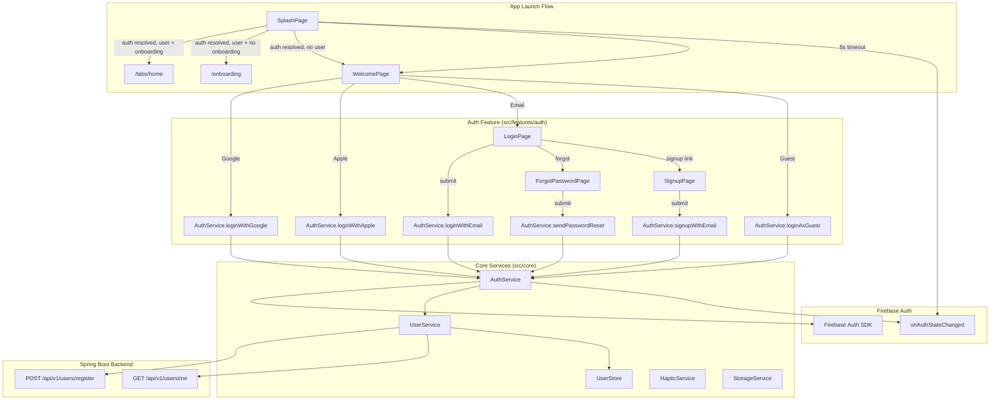
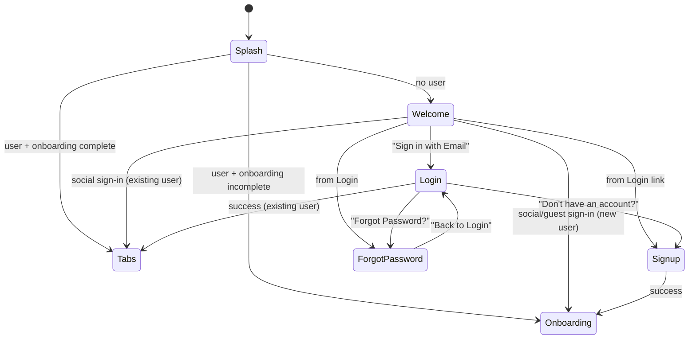
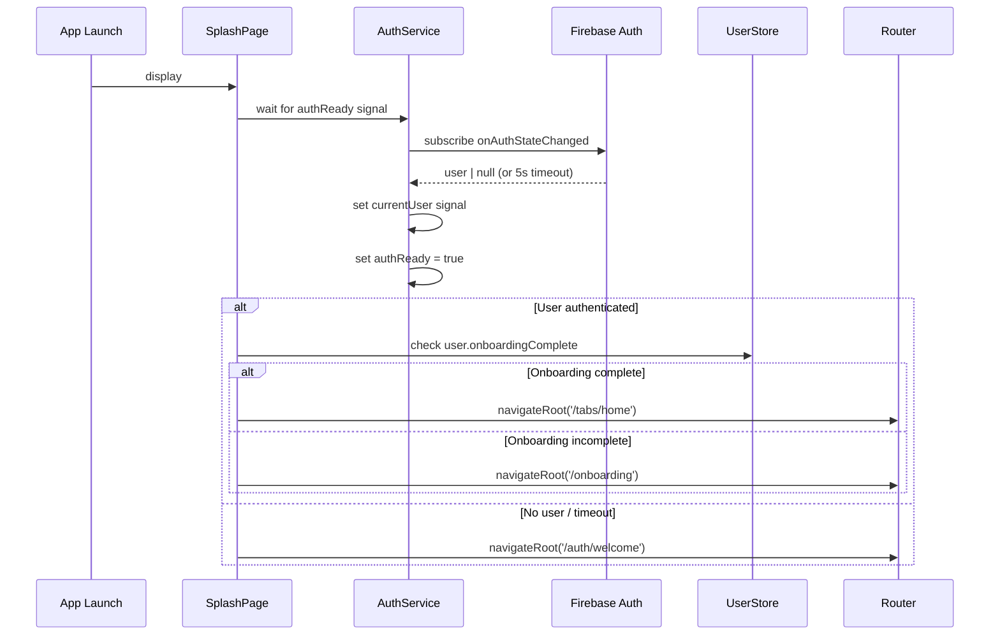

# Design Document: UI Auth

## Overview

The UI Auth feature implements the complete authentication flow for the Ascend app — from the initial splash screen through sign-in/sign-up to session persistence. It builds on the existing `ui-core-shell` infrastructure (guards, interceptors, UserStore) and introduces the `AuthService` as the central orchestrator of Firebase Auth operations, exposed via Angular signals for reactive state management.

### Design Goals

- **Signal-driven auth state**: All auth state (`currentUser`, `isAuthenticated`, `isGuest`, `authReady`) exposed as Angular signals for glitch-free reactivity.
- **Platform-adaptive**: Uses Capacitor plugins for native Google/Apple sign-in on mobile, falls back to Firebase popup on web.
- **Separation of concerns**: `AuthService` handles Firebase Auth operations only; backend profile management is delegated to `UserService`.
- **Graceful degradation**: Timeouts, fallback navigation, and error handling ensure the app never gets stuck on a loading screen.
- **Consistent UX**: All auth pages follow the app's dark theme, use Ionic components, and provide haptic feedback on success.

## Architecture



### Navigation Flow



### Auth State Resolution Sequence



## Components and Interfaces

### Pages (Smart Components)

| Page | Path | Responsibility |
|------|------|---------------|
| `SplashPage` | `/` (initial) | Displays branded loading, resolves auth state, routes accordingly |
| `WelcomePage` | `/auth/welcome` | Presents sign-in options (Google, Apple, Email, Guest) |
| `LoginPage` | `/auth/login` | Email/password login with validation and error handling |
| `SignupPage` | `/auth/signup` | Email/password registration with strength indicators |
| `ForgotPasswordPage` | `/auth/forgot-password` | Password reset email request with cooldown |

### AuthService

```typescript
@Injectable({ providedIn: 'root' })
export class AuthService {
  // --- Signals ---
  readonly currentUser: Signal<FirebaseUser | null>;
  readonly isAuthenticated: Signal<boolean>;  // computed: currentUser !== null
  readonly isGuest: Signal<boolean>;          // computed: currentUser?.isAnonymous === true
  readonly authReady: Signal<boolean>;        // false until first onAuthStateChanged emission or 5s timeout

  // --- Methods ---
  loginWithEmail(email: string, password: string): Promise<void>;
  signupWithEmail(email: string, password: string): Promise<void>;
  loginWithGoogle(): Promise<void>;
  loginWithApple(): Promise<void>;
  loginAsGuest(): Promise<void>;
  sendPasswordReset(email: string): Promise<void>;
  linkAccount(credential: AuthCredential): Promise<void>;
  logout(): Promise<void>;
  getIdToken(forceRefresh?: boolean): Promise<string | null>;
}
```

**Key behaviors:**
- Subscribes to `onAuthStateChanged` at construction time via `inject(Auth)`.
- `authReady` transitions to `true` on first emission or after 5-second timeout.
- All auth methods throw typed `AuthError` objects (`{ code: string; message: string }`).
- Does NOT call HTTP endpoints directly — delegates to `UserService` for backend profile operations.
- `loginWithGoogle()` / `loginWithApple()` detect platform (Capacitor native vs web) and use appropriate plugin.

### UserService

```typescript
@Injectable({ providedIn: 'root' })
export class UserService {
  /** Fetches the current user profile from backend. Returns null if 404. */
  getMe(): Promise<User | null>;

  /** Creates a new user profile in the backend. */
  register(data: { isGuest: boolean }): Promise<User>;

  /** Checks if user exists and routes accordingly after social/guest sign-in. */
  resolveUserAfterAuth(): Promise<'existing' | 'new'>;
}
```

### Route Configuration (Updated)

```typescript
// src/features/auth/auth.routes.ts
export const AUTH_ROUTES: Routes = [
  { path: '', redirectTo: 'welcome', pathMatch: 'full' },
  { path: 'welcome', loadComponent: () => import('./pages/welcome.page').then(m => m.WelcomePage) },
  { path: 'login', loadComponent: () => import('./pages/login.page').then(m => m.LoginPage) },
  { path: 'signup', loadComponent: () => import('./pages/signup.page').then(m => m.SignupPage) },
  { path: 'forgot-password', loadComponent: () => import('./pages/forgot-password.page').then(m => m.ForgotPasswordPage) },
];
```

### Route Guard: noAuthGuard

```typescript
/**
 * Prevents authenticated users from accessing /auth/* routes.
 * Redirects to /tabs/home if user is already authenticated.
 */
export const noAuthGuard: CanActivateFn = async () => {
  const authService = inject(AuthService);
  const router = inject(Router);

  // Wait for auth to be ready
  // If authenticated, redirect to tabs
  if (authService.isAuthenticated()) {
    return router.createUrlTree(['/tabs/home']);
  }
  return true;
};
```

### Splash Page Logic

```typescript
@Component({ standalone: true, selector: 'app-splash' })
export class SplashPage implements OnInit {
  private authService = inject(AuthService);
  private userStore = inject(UserStore);
  private router = inject(Router);
  private navCtrl = inject(NavController);

  async ngOnInit() {
    const minDisplayTime = new Promise(resolve => setTimeout(resolve, 1500));

    // Wait for auth to resolve (AuthService handles the 5s timeout internally)
    await firstValueFrom(
      toObservable(this.authService.authReady).pipe(filter(ready => ready), first())
    );

    await minDisplayTime; // Ensure minimum 1.5s display

    const user = this.authService.currentUser();
    if (user) {
      const profile = this.userStore.user();
      if (profile?.onboardingComplete) {
        this.navCtrl.navigateRoot('/tabs/home');
      } else {
        this.navCtrl.navigateRoot('/onboarding');
      }
    } else {
      this.navCtrl.navigateRoot('/auth/welcome');
    }
  }
}
```

### Form Validation Strategy

All auth forms use **Angular Reactive Forms** with synchronous validators:

```typescript
// Login form
this.loginForm = this.fb.group({
  email: ['', [Validators.required, Validators.email]],
  password: ['', [Validators.required]],
});

// Signup form
this.signupForm = this.fb.group({
  email: ['', [Validators.required, Validators.email]],
  password: ['', [Validators.required, Validators.minLength(8), passwordStrengthValidator]],
  confirmPassword: ['', [Validators.required]],
}, { validators: [passwordMatchValidator] });
```

Custom validators:
- `passwordStrengthValidator`: Checks min 8 chars, 1 uppercase, 1 special character.
- `passwordMatchValidator`: Cross-field validator ensuring `password === confirmPassword`.

## Data Models

### AuthError

```typescript
export interface AuthError {
  code: string;    // Firebase error code (e.g., 'auth/user-not-found')
  message: string; // User-facing message
}
```

### Auth Error Code Mapping

```typescript
export const AUTH_ERROR_MESSAGES: Record<string, string> = {
  'auth/user-not-found': 'Invalid email or password. Please try again.',
  'auth/wrong-password': 'Invalid email or password. Please try again.',
  'auth/invalid-credential': 'Invalid email or password. Please try again.',
  'auth/email-already-in-use': 'An account with this email already exists. Try logging in instead.',
  'auth/weak-password': 'Password is too weak. Please meet all requirements.',
  'auth/too-many-requests': 'Too many failed attempts. Please try again later.',
  'auth/network-request-failed': 'Network error. Check your connection and try again.',
  'auth/popup-closed-by-user': '', // Silent — user cancelled
  'auth/cancelled-popup-request': '', // Silent — user cancelled
};
```

### Password Strength State

```typescript
export interface PasswordStrength {
  minLength: boolean;    // >= 8 characters
  hasUppercase: boolean; // at least one uppercase letter
  hasSpecial: boolean;   // at least one special character
}
```

### Splash Navigation Decision

```typescript
type SplashDestination = '/tabs/home' | '/onboarding' | '/auth/welcome';
```

### Forgot Password Cooldown State

```typescript
interface ForgotPasswordState {
  submitted: boolean;
  cooldownSeconds: number; // 60 → 0 countdown
  canSubmit: boolean;      // computed: !submitted || cooldownSeconds === 0
}
```

### Platform Detection

```typescript
export type AuthPlatform = 'ios' | 'android' | 'web';

// Used to determine which sign-in plugin to invoke
function getAuthPlatform(): AuthPlatform {
  if (Capacitor.isNativePlatform()) {
    return Capacitor.getPlatform() as 'ios' | 'android';
  }
  return 'web';
}
```


## Correctness Properties

*A property is a characteristic or behavior that should hold true across all valid executions of a system — essentially, a formal statement about what the system should do. Properties serve as the bridge between human-readable specifications and machine-verifiable correctness guarantees.*

### Property 1: Email validation correctness

*For any* string input to the email field, the email validator SHALL return valid if and only if the string matches a standard email format (contains exactly one `@`, has a non-empty local part, and has a domain with at least one dot). All other strings SHALL be rejected as invalid.

**Validates: Requirements 3.1, 4.1, 5.1, 12.1**

### Property 2: Password strength indicator correctness

*For any* string input to the password field on the signup page, the strength indicators SHALL reflect: `minLength = (string.length >= 8)`, `hasUppercase = (/[A-Z]/.test(string))`, and `hasSpecial = (/[!@#$%^&*(),.?":{}|<>]/.test(string))`. Each indicator is independent and computed solely from the string content.

**Validates: Requirements 4.4, 12.2**

### Property 3: Confirm password mismatch detection

*For any* two strings entered in the password and confirm password fields, the "Passwords do not match" error SHALL be displayed if and only if the two strings are not identical.

**Validates: Requirements 12.3**

### Property 4: Form submit button disabled state reflects validation

*For any* combination of form field values on the login, signup, or forgot-password pages, the submit button SHALL be disabled if and only if the form's overall validity is false (i.e., at least one field fails its validation rules).

**Validates: Requirements 3.3, 4.5, 5.2**

### Property 5: Auth error code to message mapping

*For any* Firebase Auth error code that exists in the `AUTH_ERROR_MESSAGES` mapping, the error displayed to the user SHALL be exactly the mapped message string. For error codes mapped to an empty string (user cancellation), no error message SHALL be displayed.

**Validates: Requirements 3.8, 3.9, 3.10, 4.9, 4.10, 4.11, 5.7, 10.7**

### Property 6: Forgot password cooldown timer

*For any* time value T (in seconds) after a successful password reset submission, the "Send Reset Link" button SHALL be disabled if T < 60, and SHALL be enabled if T >= 60.

**Validates: Requirements 5.9**

### Property 7: Platform-specific sign-in method selection

*For any* platform value (`'ios'`, `'android'`, `'web'`), the Google sign-in method SHALL use the Capacitor Google Auth plugin when platform is `'ios'` or `'android'`, and SHALL use Firebase `signInWithPopup` with GoogleAuthProvider when platform is `'web'`. The Apple sign-in method SHALL use the Capacitor Sign In with Apple plugin when platform is `'ios'`, and SHALL use Firebase `signInWithPopup` with OAuthProvider('apple.com') when platform is `'web'`.

**Validates: Requirements 6.1, 7.1**

### Property 8: Apple sign-in button platform visibility

*For any* platform value, the Apple Sign-In button SHALL be rendered if and only if the platform is `'ios'` or `'web'`. It SHALL NOT be rendered when the platform is `'android'`.

**Validates: Requirements 2.4, 7.8**

### Property 9: isGuest signal reflects anonymous state

*For any* Firebase Auth user object (or null), the `isGuest` signal SHALL return `true` if and only if the user is not null AND `user.isAnonymous === true`. For null users or non-anonymous users, it SHALL return `false`.

**Validates: Requirements 8.5, 10.5**

### Property 10: isAuthenticated signal reflects currentUser presence

*For any* value of the `currentUser` signal (either a Firebase User object or null), the `isAuthenticated` computed signal SHALL return `true` if and only if `currentUser` is not null.

**Validates: Requirements 10.4**

### Property 11: noAuthGuard redirects authenticated users from auth routes

*For any* route path matching `/auth/*` (welcome, login, signup, forgot-password), when the current user is authenticated, the `noAuthGuard` SHALL redirect to `/tabs/home` and prevent access to the auth route.

**Validates: Requirements 11.4**

## Error Handling

### Auth Service Errors

| Scenario | Handling |
|----------|----------|
| Firebase `signInWithEmailAndPassword` fails | Throw typed `AuthError` with mapped message; calling page displays inline error |
| Firebase `createUserWithEmailAndPassword` fails | Throw typed `AuthError`; signup page displays inline error |
| Firebase `sendPasswordResetEmail` fails with `auth/user-not-found` | Suppress error, show generic success message (prevent email enumeration) |
| Firebase `signInWithPopup` cancelled by user | Throw `AuthError` with empty message; calling page ignores silently |
| Firebase `signInAnonymously` fails | Throw `AuthError`; welcome page shows toast |
| Firebase `linkWithCredential` fails with `auth/credential-already-in-use` | Throw `AuthError` with specific message; offer to sign in with existing account |
| Network error during any auth operation | Throw `AuthError` with code `auth/network-request-failed` |
| Token refresh failure (account disabled/deleted) | Clear session, reset UserStore, navigate to `/auth/welcome` |

### Backend Communication Errors

| Scenario | Handling |
|----------|----------|
| `GET /api/v1/users/me` returns 404 | Treat as new user — proceed to registration |
| `POST /api/v1/users/register` fails with 5xx | Show toast "Account setup failed. Please try again." and remain on current screen |
| `POST /api/v1/users/register` fails with network error | Show toast "Network error. Check your connection." |
| Backend timeout (handled by retry interceptor) | Retry up to 3 times; if all fail, show error toast |

### Form Validation Errors

| Scenario | Handling |
|----------|----------|
| Invalid email format | Display "Please enter a valid email address" below field on blur |
| Password too short / missing uppercase / missing special | Show red ✗ next to unmet requirement in real-time |
| Passwords don't match | Display "Passwords do not match" below confirm field on input |
| Submit with invalid form | Focus first invalid field, scroll into view |

### Navigation Error Recovery

| Scenario | Handling |
|----------|----------|
| Splash auth resolution timeout (5s) | Navigate to welcome screen (safe fallback) |
| UserStore has no profile after auth | Navigate to onboarding (assume new user) |
| noAuthGuard detects authenticated user on /auth/* | Redirect to /tabs/home |
| authGuard detects unauthenticated user on /tabs/* | Store return URL, redirect to /auth/login |

### Error Propagation Philosophy

- **AuthService**: Throws typed `AuthError` objects — never swallows errors silently (except user cancellation).
- **Pages**: Catch `AuthError`, display appropriate inline error or toast, never re-throw.
- **Guards**: Never throw — always redirect to a safe route.
- **UserService**: Propagates HTTP errors to AuthService; AuthService wraps them in `AuthError`.

## Testing Strategy

### Testing Framework

- **Unit/Integration tests**: Jasmine + Karma (Angular default) with Angular TestBed
- **Property-based tests**: [fast-check](https://github.com/dubzzz/fast-check) for TypeScript
- **Component tests**: Angular TestBed with standalone component harnesses
- **E2E tests**: Cypress or Playwright for critical auth flows (optional, not in scope for this spec)

### Property-Based Testing Configuration

Each property test runs a minimum of **100 iterations** with fast-check's default shrinking enabled.

Each property test is tagged with a comment referencing its design property:
```typescript
// Feature: ui-auth, Property 1: Email validation correctness
```

### Test Categories

#### Smoke Tests (Static Configuration)
- Auth routes defined under `/auth` prefix with correct child paths (11.1)
- AuthService is `providedIn: 'root'` singleton (10.1)
- AuthService exposes required signals and methods (10.2, 10.6)
- Forms use Angular Reactive Forms with synchronous validators (12.7)
- Firebase Auth persistence configured (9.1)
- onAuthStateChanged subscription at init (9.7)

#### Example-Based Unit Tests
- Splash screen DOM structure (1.1, 1.2, 1.3)
- Splash navigation decisions based on auth state (1.5, 1.6, 1.7, 1.8, 1.9)
- Welcome screen button presence and actions (2.1–2.3, 2.5, 2.6, 2.8–2.10)
- Password visibility toggle (3.2, 4.2)
- Navigation links between auth pages (3.4, 3.5, 4.6, 5.3)
- Loading spinner during requests (3.11, 4.12, 5.8)
- Haptic feedback on success (3.12, 4.13)
- Successful login/signup navigation (3.7, 4.8)
- Google/Apple sign-in flows: cancel silent, network error toast (6.4–6.7, 7.2–7.7)
- Guest mode flows (8.1–8.3, 8.6, 8.7)
- Session persistence and logout (9.2–9.4, 9.6)
- authReady signal transition (10.3)
- noAuthGuard and navigateRoot behavior (11.2, 11.3, 11.6)
- Error disappears on valid input (12.4)
- Submit focuses first invalid field (12.6)
- Forgot password success message and enumeration prevention (5.5, 5.6)

#### Property-Based Tests (11 properties)
- Email validation correctness (Property 1)
- Password strength indicators (Property 2)
- Confirm password mismatch detection (Property 3)
- Form submit button disabled state (Property 4)
- Auth error code to message mapping (Property 5)
- Forgot password cooldown timer (Property 6)
- Platform-specific sign-in method selection (Property 7)
- Apple button platform visibility (Property 8)
- isGuest signal (Property 9)
- isAuthenticated signal (Property 10)
- noAuthGuard redirect for authenticated users (Property 11)

#### Integration Tests
- Full Google sign-in flow with mocked Capacitor plugin and Firebase
- Full Apple sign-in flow with mocked Capacitor plugin and Firebase
- Guest → account linking flow
- Splash → auth resolution → navigation flow
- Login → backend profile fetch → navigation flow

### Test File Organization

```
src/features/auth/__tests__/
  splash.page.spec.ts
  welcome.page.spec.ts
  login.page.spec.ts
  login.page.property.spec.ts
  signup.page.spec.ts
  signup.page.property.spec.ts
  forgot-password.page.spec.ts
  forgot-password.page.property.spec.ts

src/core/services/__tests__/
  auth.service.spec.ts
  auth.service.property.spec.ts
  user.service.spec.ts

src/core/auth/__tests__/
  no-auth.guard.spec.ts
  no-auth.guard.property.spec.ts

src/shared/validators/__tests__/
  email.validator.property.spec.ts
  password-strength.validator.property.spec.ts
  password-match.validator.property.spec.ts
```
