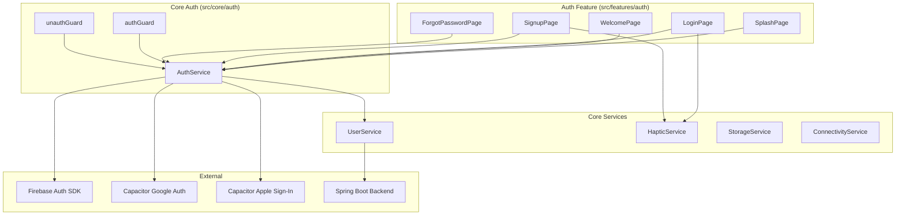
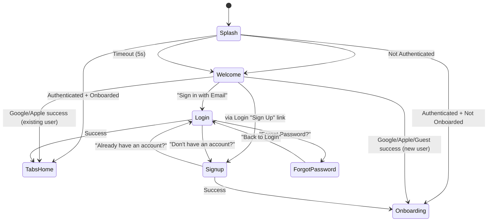
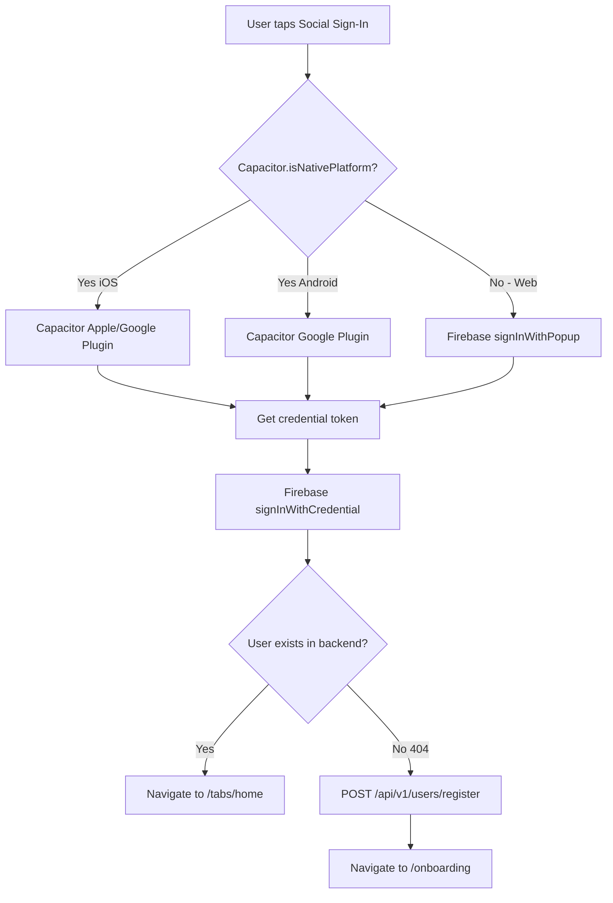

# Design Document: UI Auth

## Overview

The UI Auth feature implements the complete authentication flow for the Ascend app — from the initial splash screen through social sign-in, email/password authentication, guest mode, and session persistence. It builds on the core shell infrastructure (interceptors, guards, platform services) and provides the user-facing screens and the `AuthService` that orchestrates Firebase Auth operations.

### Design Goals

- **Platform-adaptive**: Social sign-in uses native Capacitor plugins on iOS/Android and Firebase popup on web, abstracted behind a single service interface.
- **Signal-driven state**: All auth state (`currentUser`, `isAuthenticated`, `isGuest`, `authReady`) is exposed as Angular signals for glitch-free reactivity.
- **Separation of concerns**: `AuthService` handles Firebase Auth operations only; backend profile management is delegated to `UserService`.
- **Resilient UX**: Minimum splash duration, timeout fallbacks, and typed error propagation ensure the user never gets stuck.
- **Consistent with ui-core-shell**: Uses the same functional guard/interceptor patterns, signal-based stores, and Ionic navigation conventions.

## Architecture



### Navigation Flow



### Route Structure

All auth screens live under the `/auth` prefix and are lazy-loaded as a feature chunk:

```
/auth
  /auth/splash        → SplashPage (entry point on cold start)
  /auth/welcome       → WelcomePage
  /auth/login         → LoginPage
  /auth/signup        → SignupPage
  /auth/forgot-password → ForgotPasswordPage
```

### Guard Strategy

| Guard | Applied To | Purpose |
|-------|-----------|---------|
| `authGuard` | `/tabs` | Redirects unauthenticated users to `/auth/welcome` |
| `unauthGuard` | `/auth/welcome`, `/auth/login`, `/auth/signup`, `/auth/forgot-password` | Redirects authenticated users to `/tabs/home` |
| `onboardingGuard` | `/tabs` | Redirects users who haven't completed onboarding |

## Components and Interfaces

### AuthService

```typescript
@Injectable({ providedIn: 'root' })
export class AuthService {
  // --- Signals ---
  readonly currentUser: Signal<FirebaseUser | null>;
  readonly isAuthenticated: Signal<boolean>;   // computed: currentUser !== null
  readonly isGuest: Signal<boolean>;           // computed: currentUser?.isAnonymous === true
  readonly authReady: Signal<boolean>;         // false until first onAuthStateChanged or 5s timeout

  // --- Methods ---
  loginWithEmail(email: string, password: string): Promise<UserCredential>;
  signupWithEmail(email: string, password: string): Promise<UserCredential>;
  loginWithGoogle(): Promise<UserCredential>;
  loginWithApple(): Promise<UserCredential>;
  loginAsGuest(): Promise<UserCredential>;
  sendPasswordReset(email: string): Promise<void>;
  linkAccount(credential: AuthCredential): Promise<UserCredential>;
  logout(): Promise<void>;
}
```

**Key behaviors:**
- Subscribes to `onAuthStateChanged` at construction time via `@angular/fire`'s `authState` observable.
- Sets `authReady` to `true` on first emission or after 5-second timeout.
- All methods throw typed `AuthError` objects (`{ code: string; message: string }`) on failure.
- Does NOT call HTTP endpoints directly — delegates to `UserService` for profile operations.
- Platform detection for social sign-in uses `Capacitor.isNativePlatform()`.

### UserService

```typescript
@Injectable({ providedIn: 'root' })
export class UserService {
  /** Fetches the current user's profile from the backend. Returns null if 404. */
  getMe(): Promise<User | null>;

  /** Creates a new user profile on the backend after Firebase account creation. */
  register(data: RegisterUserDto): Promise<User>;
}
```

### Auth Pages (Standalone Components)

| Component | Selector | Responsibility |
|-----------|----------|---------------|
| `SplashPage` | `app-splash` | Displays branded loading, resolves auth state, routes accordingly |
| `WelcomePage` | `app-welcome` | Displays sign-in options (Google, Apple, Email, Guest) |
| `LoginPage` | `app-login` | Email/password login form with validation |
| `SignupPage` | `app-signup` | Email/password registration with strength indicators |
| `ForgotPasswordPage` | `app-forgot-password` | Password reset email request |

All pages are standalone components importing `IonicModule` (or individual Ionic components) and `ReactiveFormsModule` where needed.

### unauthGuard

```typescript
export const unauthGuard: CanActivateFn = async () => {
  const authService = inject(AuthService);
  const router = inject(Router);

  // Wait for auth to be ready
  if (!authService.authReady()) {
    await firstValueFrom(toObservable(authService.authReady).pipe(filter(Boolean), first()));
  }

  if (authService.isAuthenticated()) {
    return router.createUrlTree(['/tabs/home']);
  }
  return true;
};
```

### Platform-Specific Social Sign-In Strategy



### Form Validation Strategy

All auth forms use **Angular Reactive Forms** with synchronous validators:

```typescript
// Login form
this.loginForm = this.fb.group({
  email: ['', [Validators.required, Validators.email]],
  password: ['', [Validators.required]],
});

// Signup form
this.signupForm = this.fb.group({
  email: ['', [Validators.required, Validators.email]],
  password: ['', [Validators.required, Validators.minLength(8), passwordStrengthValidator]],
  confirmPassword: ['', [Validators.required]],
}, { validators: [passwordMatchValidator] });
```

Custom validators:
- `passwordStrengthValidator`: Checks min 8 chars, 1 uppercase, 1 special character.
- `passwordMatchValidator`: Cross-field validator ensuring `password === confirmPassword`.

## Data Models

### AuthError

```typescript
export interface AuthError {
  readonly code: string;    // Firebase error code (e.g., 'auth/wrong-password')
  readonly message: string; // User-facing message
}
```

### RegisterUserDto

```typescript
export interface RegisterUserDto {
  readonly firebaseUid: string;
  readonly email: string | null;
  readonly displayName: string | null;
  readonly avatarUrl: string | null;
  readonly isGuest: boolean;
}
```

### Auth State (internal to AuthService)

```typescript
interface AuthState {
  user: FirebaseUser | null;
  ready: boolean;
}
```

### Password Validation State

```typescript
export interface PasswordStrength {
  readonly minLength: boolean;    // >= 8 characters
  readonly hasUppercase: boolean; // at least one uppercase letter
  readonly hasSpecial: boolean;   // at least one special character
}
```

### Firebase Error Code Mapping

```typescript
const ERROR_MESSAGES: Record<string, string> = {
  'auth/user-not-found': 'Invalid email or password. Please try again.',
  'auth/wrong-password': 'Invalid email or password. Please try again.',
  'auth/email-already-in-use': 'An account with this email already exists. Try logging in instead.',
  'auth/weak-password': 'Password is too weak. Please meet all requirements.',
  'auth/too-many-requests': 'Too many failed attempts. Please try again later.',
  'auth/network-request-failed': 'Network error. Check your connection and try again.',
  'auth/popup-closed-by-user': '__SILENT__', // No error shown
  'auth/cancelled-popup-request': '__SILENT__',
};
```

