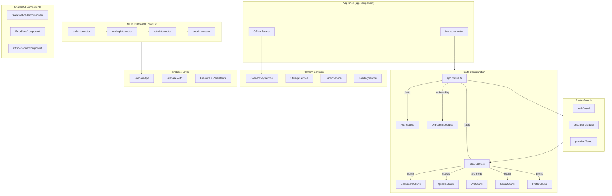

# Design Document: UI Core Shell

## Overview

The UI Core Shell is the foundational infrastructure layer of the Ascend app. It provides the routing skeleton, navigation chrome, authentication/authorization guards, HTTP pipeline (interceptors for auth tokens, error handling, loading state, and retries), Firebase/Firestore initialization, offline connectivity awareness, skeleton loaders, error states, and essential platform services (haptic feedback, connectivity detection, local storage).

This layer is intentionally "invisible" to end users — it ensures that every feature module loads securely, communicates reliably with the backend, and degrades gracefully when the network is unavailable.

### Design Goals

- **Lazy-first**: Every feature route produces its own JS chunk; the shell itself is minimal.
- **Signal-driven**: All reactive state (loading, connectivity, user) is exposed via Angular signals for glitch-free, zone-less reactivity.
- **Functional style**: Guards and interceptors are plain functions (`CanActivateFn`, `HttpInterceptorFn`) — no class-based boilerplate.
- **Resilient**: Automatic retries, token refresh queuing, and offline persistence ensure the app works on unstable connections.
- **Reusable**: Skeleton loaders and error states are standalone components importable by any feature.

## Architecture



### Interceptor Ordering

Interceptors execute in registration order. The chosen order is:

1. **authInterceptor** — Attaches Bearer token (must run first so downstream interceptors see the final request).
2. **loadingInterceptor** — Increments/decrements the loading counter (must wrap the actual HTTP call).
3. **retryInterceptor** — Retries transient failures (retries happen before error handling).
4. **errorInterceptor** — Catches final errors, shows toasts, handles 401 logout.

### Guard Execution Order on `/tabs`

The `tabs` route applies guards in this order:
1. `authGuard` — Ensures user is authenticated.
2. `onboardingGuard` — Ensures onboarding is complete.

Premium guard is applied individually to specific child routes (AI Coach, advanced analytics).

## Components and Interfaces

### Route Guards

| Guard | Type | Applied To | Behavior |
|-------|------|-----------|----------|
| `authGuard` | `CanActivateFn` | `/tabs` route | Redirects to `/auth/login` if unauthenticated; stores return URL |
| `onboardingGuard` | `CanActivateFn` | `/tabs` route | Redirects to `/onboarding` if onboarding incomplete |
| `premiumGuard` | `CanActivateFn` | AI Coach, Advanced Analytics routes | Redirects to premium upgrade page if not premium |

### HTTP Interceptors

| Interceptor | Type | Responsibility |
|-------------|------|---------------|
| `authInterceptor` | `HttpInterceptorFn` | Attaches Firebase JWT; refreshes token when near expiry; queues concurrent requests during refresh |
| `loadingInterceptor` | `HttpInterceptorFn` | Manages global loading counter with 300ms debounce |
| `retryInterceptor` | `HttpInterceptorFn` | Exponential backoff retry for transient failures |
| `errorInterceptor` | `HttpInterceptorFn` | Toast notifications for 403/5xx; 401 auto-logout; deduplication |

### Platform Services

```typescript
// ConnectivityService
@Injectable({ providedIn: 'root' })
export class ConnectivityService {
  readonly isOnline: Signal<boolean>;
}

// StorageService
@Injectable({ providedIn: 'root' })
export class StorageService {
  get<T>(key: string): Promise<T | null>;
  set(key: string, value: unknown): Promise<void>;
  remove(key: string): Promise<void>;
  clear(): Promise<void>;
}

// HapticService
@Injectable({ providedIn: 'root' })
export class HapticService {
  impact(style: 'light' | 'medium' | 'heavy'): Promise<void>;
  notification(type: 'success' | 'warning' | 'error'): Promise<void>;
  vibrate(duration: number): Promise<void>;
}

// LoadingService
@Injectable({ providedIn: 'root' })
export class LoadingService {
  readonly isLoading: Signal<boolean>;
}
```

### Shared UI Components

```typescript
// SkeletonLoaderComponent
@Component({ standalone: true, selector: 'app-skeleton-loader' })
export class SkeletonLoaderComponent {
  @Input() shape: 'rectangle' | 'circle' | 'text-line' = 'rectangle';
  @Input() width: string = '100%';
  @Input() height: string = '16px';
  @Input() borderRadius: string = '4px';
}

// ErrorStateComponent
@Component({ standalone: true, selector: 'app-error-state' })
export class ErrorStateComponent {
  @Input() message: string = 'Something went wrong. Tap to try again.';
  @Input() icon: string = 'alert-circle-outline';
  @Output() retry = new EventEmitter<void>();
}

// OfflineBannerComponent
@Component({ standalone: true, selector: 'app-offline-banner' })
export class OfflineBannerComponent {
  // Injects ConnectivityService, manages banner visibility and "Back online" auto-dismiss
}
```

### HttpContext Tokens

```typescript
// Skip loading indicator for background requests
export const SKIP_LOADING = new HttpContextToken<boolean>(() => false);

// Mark non-idempotent requests as retryable
export const RETRYABLE = new HttpContextToken<boolean>(() => false);
```

## Data Models

### Environment Configuration

```typescript
export interface FirebaseConfig {
  apiKey: string;
  authDomain: string;
  projectId: string;
  storageBucket: string;
  messagingSenderId: string;
  appId: string;
}

export interface Environment {
  production: boolean;
  apiUrl: string;
  firebase: FirebaseConfig;
}
```

### Loading State

```typescript
// Internal to LoadingService
interface LoadingState {
  counter: number;        // Active request count
  debounceTimer: number;  // setTimeout handle for 300ms debounce
  visible: boolean;       // Whether indicator is currently shown
}
```

### Storage Key Constraints

```typescript
// StorageService internal constants
const STORAGE_PREFIX = 'ascend_';
const MAX_KEY_LENGTH = 256;
```

### Connectivity State

```typescript
// ConnectivityService uses a WritableSignal internally
// Exposed as readonly Signal<boolean> to consumers
```

### Haptic Preferences

```typescript
// Persisted via StorageService with key 'haptic_enabled'
// Default: true (enabled for new users)
```

### Auth Guard State

```typescript
// Stored in sessionStorage or a service for redirect-after-login
interface PendingRedirect {
  url: string;
}
```

### Retry Configuration

```typescript
interface RetryConfig {
  maxRetries: number;       // 3
  baseDelay: number;        // 1000ms
  maxRetryAfter: number;    // 60000ms
}
```

## Correctness Properties

*A property is a characteristic or behavior that should hold true across all valid executions of a system — essentially, a formal statement about what the system should do. Properties serve as the bridge between human-readable specifications and machine-verifiable correctness guarantees.*

### Property 1: Auth guard stores return URL

*For any* valid route URL that an unauthenticated user attempts to access, the auth guard SHALL store that exact URL so it can be used for post-login redirection, and SHALL redirect to `/auth/login`.

**Validates: Requirements 3.1**

### Property 2: Auth interceptor attaches token for API URLs

*For any* HTTP request whose URL starts with `environment.apiUrl`, when a valid Firebase user is authenticated, the interceptor SHALL clone the request with an `Authorization: Bearer <token>` header.

**Validates: Requirements 6.1**

### Property 3: Auth interceptor passes through non-API URLs

*For any* HTTP request whose URL does NOT start with `environment.apiUrl`, the interceptor SHALL forward the request without adding or modifying the `Authorization` header.

**Validates: Requirements 6.2**

### Property 4: Error interceptor toasts for server errors

*For any* HTTP response with a status code between 500 and 599 (inclusive), the error interceptor SHALL display an error toast with a 4000ms duration and re-throw the error.

**Validates: Requirements 7.3**

### Property 5: Error interceptor silent for non-special client errors

*For any* HTTP response with a status code between 400 and 499 (inclusive) that is NOT 401 or 403, the error interceptor SHALL re-throw the error without displaying a toast notification.

**Validates: Requirements 7.6**

### Property 6: Loading counter increments for trackable requests

*For any* HTTP request that does NOT carry the `SKIP_LOADING` HttpContext token, starting the request SHALL increment the loading counter by exactly 1.

**Validates: Requirements 8.1**

### Property 7: Loading counter invariant — never negative

*For any* sequence of HTTP request starts and completions, the loading counter SHALL never fall below zero.

**Validates: Requirements 8.2**

### Property 8: Loading counter ignores skip-loading requests

*For any* HTTP request that carries the `SKIP_LOADING` HttpContext token, the loading counter SHALL remain unchanged throughout the request lifecycle.

**Validates: Requirements 8.7**

### Property 9: Retry with exponential backoff for transient failures

*For any* idempotent HTTP request (or non-idempotent with RETRYABLE token) that fails with a network error (status 0), timeout, or server error (500-599), the retry interceptor SHALL retry up to 3 times with delays of 1000ms, 2000ms, and 4000ms between attempts.

**Validates: Requirements 9.1**

### Property 10: Retry-After header clamped to 60 seconds

*For any* 429 response that includes a `Retry-After` header with a numeric value, the retry interceptor SHALL use `min(Retry-After value in ms, 60000)` as the delay before the next retry attempt.

**Validates: Requirements 9.2**

### Property 11: No retry for non-retryable client errors

*For any* HTTP response with a 4xx status code that is NOT 408 (Request Timeout) or 429 (Too Many Requests), the retry interceptor SHALL NOT retry and SHALL immediately propagate the error.

**Validates: Requirements 9.3**

### Property 12: No retry for non-idempotent requests without retryable token

*For any* HTTP request with method POST, PUT, or PATCH that does NOT carry the `RETRYABLE` HttpContext token, the retry interceptor SHALL NOT retry regardless of the error type.

**Validates: Requirements 9.4**

### Property 13: Skeleton loader dimension handling

*For any* dimension input (width, height, borderRadius), the skeleton loader SHALL render with the provided value if it is a valid positive value, or fall back to defaults (width: 100%, height: 16px, borderRadius: 4px) if the value is zero, negative, or invalid.

**Validates: Requirements 12.2, 12.7**

### Property 14: Error state message truncation

*For any* message string input to the error state component, the displayed text SHALL be at most 150 characters. If the input exceeds 150 characters, it SHALL be truncated.

**Validates: Requirements 13.3**

### Property 15: Haptic no-op when unsupported or disabled

*For any* haptic method call (impact, notification, or vibrate with any valid arguments), if the device does not support haptics OR the user preference `haptic_enabled` is false, the method SHALL resolve successfully without triggering any device vibration and without throwing an error.

**Validates: Requirements 14.3, 14.4**

### Property 16: Storage service round-trip

*For any* JSON-serializable value and valid key string, calling `set(key, value)` followed by `get<T>(key)` SHALL return a value deeply equal to the original.

**Validates: Requirements 16.3**

### Property 17: Storage key prefixing

*For any* valid key string passed to the storage service, the underlying Capacitor Preferences call SHALL receive the key prefixed with `ascend_`.

**Validates: Requirements 16.4**

### Property 18: Storage graceful failure handling

*For any* storage operation (get, set, remove, clear) where the underlying Capacitor Preferences throws an error, the storage service SHALL NOT propagate the exception to the caller — `get` SHALL return `null` and mutating operations SHALL resolve silently.

**Validates: Requirements 16.6**

### Property 19: Storage key validation

*For any* key string that is empty or exceeds 256 characters, the storage service SHALL reject the operation gracefully — `get` returns `null`, `set` and `remove` resolve silently — without calling the underlying Capacitor Preferences.

**Validates: Requirements 16.9**

## Error Handling

### Guard Errors

| Scenario | Handling |
|----------|----------|
| Firebase Auth observable timeout (5s) | Auth guard redirects to `/auth/login` |
| Capacitor Preferences read failure | Onboarding guard falls back to user profile; if both fail, redirects to `/onboarding` |
| UserStore returns null | Premium guard denies access, redirects to upgrade page |

### Interceptor Errors

| Scenario | Handling |
|----------|----------|
| Token retrieval failure | Auth interceptor forwards request without token (no blocking) |
| Token retrieval timeout (10s) | Auth interceptor forwards request without token |
| 401 response | Error interceptor clears auth, resets UserStore, navigates to login |
| 403 response | Error interceptor shows "insufficient permissions" toast (3000ms) |
| 5xx response | Error interceptor shows "server problem, retry" toast (4000ms) |
| Network error (status 0) | Error interceptor re-throws silently (no toast); retry interceptor handles retries |
| All retries exhausted | Retry interceptor propagates final error to caller |
| Duplicate toast prevention | Error interceptor tracks visible toast category, suppresses duplicates |

### Service Errors

| Scenario | Handling |
|----------|----------|
| Capacitor Network plugin unavailable | ConnectivityService falls back to `navigator.onLine` + window events |
| Capacitor Haptics unavailable | HapticService resolves all calls as no-ops |
| Capacitor Preferences operation failure | StorageService logs warning, returns null/resolves silently |
| JSON.stringify failure (circular ref) | StorageService logs warning, does not persist |
| Firestore persistence failure (multi-tab) | App continues with in-memory cache, logs warning |

### Error Propagation Philosophy

- **Guards**: Never throw — always redirect to a safe fallback route.
- **Interceptors**: Always re-throw the error after handling (toast/logout) so calling code can react.
- **Services**: Never throw to consumers — log warnings and return safe defaults.

## Testing Strategy

### Testing Framework

- **Unit/Integration tests**: Jasmine + Karma (Angular default) or Jest
- **Property-based tests**: [fast-check](https://github.com/dubzzz/fast-check) for TypeScript
- **Component tests**: Angular TestBed with standalone component harnesses

### Property-Based Testing Configuration

Each property test runs a minimum of **100 iterations** with fast-check's default shrinking enabled.

Each property test is tagged with a comment referencing its design property:
```typescript
// Feature: ui-core-shell, Property 16: Storage service round-trip
```

### Test Categories

#### Smoke Tests (Static Configuration)
- Route configuration has correct paths (1.1, 1.2, 1.3, 1.5)
- Guards applied to correct routes (3.5, 4.4, 5.6)
- Firebase providers registered in correct order (10.1–10.6)
- Components are standalone (12.5, 13.4)
- Services are singleton (14.6, 15.1, 15.7, 16.8)

#### Example-Based Unit Tests
- Auth guard timeout and emission scenarios (3.2, 3.3, 3.4, 3.6)
- Premium guard boolean logic (4.1, 4.2, 4.3)
- Onboarding guard dual-source logic (5.1–5.5)
- Token refresh queuing (6.6)
- Error interceptor specific status handling (7.1, 7.2, 7.4, 7.7)
- Loading indicator debounce timing (8.3, 8.4, 8.5)
- Retry cancellation and exhaustion (9.5, 9.6)
- Offline banner transitions (11.1–11.7)
- Tab bar rendering and interaction (2.1–2.7)
- Error state component interactions (13.1, 13.2, 13.5–13.8)

#### Property-Based Tests (19 properties)
- Storage round-trip, key prefixing, validation, failure handling (Properties 16–19)
- Interceptor URL discrimination (Properties 2–3)
- Error categorization (Properties 4–5)
- Loading counter behavior (Properties 6–8)
- Retry logic (Properties 9–12)
- Skeleton dimension handling (Property 13)
- Error message truncation (Property 14)
- Haptic no-op conditions (Property 15)
- Auth guard URL storage (Property 1)

#### Integration Tests
- Firebase initialization with real @angular/fire providers
- Capacitor plugin integration (Network, Haptics, Preferences)
- Full interceptor pipeline with TestBed HttpClient

### Test File Organization

```
src/core/auth/__tests__/
  auth.guard.spec.ts
  onboarding.guard.spec.ts
  premium.guard.spec.ts

src/core/interceptors/__tests__/
  auth.interceptor.spec.ts
  auth.interceptor.property.spec.ts
  error.interceptor.spec.ts
  error.interceptor.property.spec.ts
  loading.interceptor.spec.ts
  loading.interceptor.property.spec.ts
  retry.interceptor.spec.ts
  retry.interceptor.property.spec.ts

src/core/services/__tests__/
  connectivity.service.spec.ts
  storage.service.spec.ts
  storage.service.property.spec.ts
  haptic.service.spec.ts
  haptic.service.property.spec.ts
  loading.service.spec.ts

src/shared/components/__tests__/
  skeleton-loader.component.spec.ts
  skeleton-loader.component.property.spec.ts
  error-state.component.spec.ts
  error-state.component.property.spec.ts
  offline-banner.component.spec.ts
```

