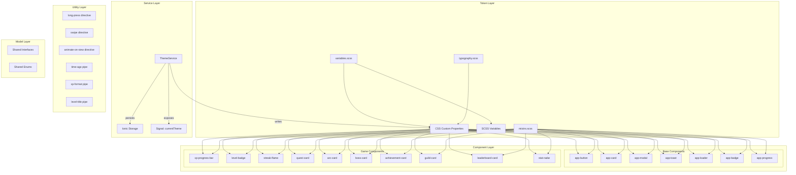
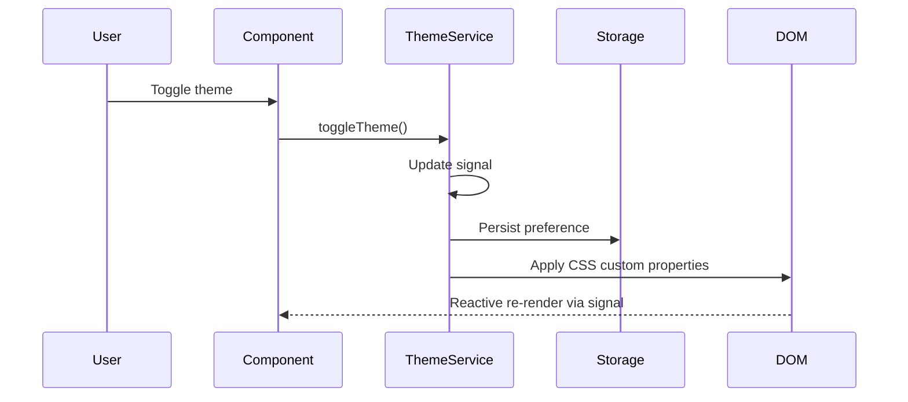

# Design Document: UI Design System

## Overview

The UI Design System provides the foundational visual layer for the Ascend mobile application — a gamification/RPG-themed habit-tracking app built with Angular 17+ standalone components and Ionic Framework. This design system establishes a centralized SCSS architecture, reactive theme management, reusable base and game-specific components, custom directives, pipes, and shared TypeScript models.

The system follows a layered architecture:
1. **Token Layer** — SCSS variables and CSS custom properties defining the visual language
2. **Mixin Layer** — Reusable SCSS patterns for consistent styling
3. **Service Layer** — Theme management via Angular signals with persistence
4. **Component Layer** — Standalone presentation components (base + game)
5. **Utility Layer** — Directives, pipes, and shared models

All components are standalone (no NgModules), use OnPush change detection, and follow the Smart/Dumb component pattern where design system components are strictly "dumb" (presentation-only, no business logic).

## Architecture

### High-Level Architecture Diagram



### Data Flow



## Components and Interfaces

### Theme Service

```typescript
// core/services/theme.service.ts
@Injectable({ providedIn: 'root' })
export class ThemeService {
  // Reactive state
  currentTheme: WritableSignal<'dark' | 'light'>;
  isDarkMode: Signal<boolean>;

  // Public API
  initialize(): Promise<void>;       // Load saved preference or detect device
  setTheme(theme: 'dark' | 'light'): void;
  toggleTheme(): void;
}
```

**Design Decisions:**
- Uses Angular `signal()` for reactive theme state — components automatically re-render when theme changes
- Persists to Ionic Storage (Capacitor Preferences) for cross-platform compatibility
- Applies theme by setting CSS custom properties on `document.documentElement`
- Checks `prefers-color-scheme` media query as fallback when no saved preference exists
- Initializes in `APP_INITIALIZER` to prevent flash of wrong theme

### Base Components

All base components follow this pattern:
- Standalone with `changeDetection: ChangeDetectionStrategy.OnPush`
- Import only `CommonModule` and `IonicModule` (plus other shared components as needed)
- Use `input()` signal inputs (Angular 17+) for type-safe bindings
- Use `output()` for event emission
- Prefix selectors with `app-`

#### app-button

```typescript
// shared/components/app-button/app-button.component.ts
@Component({
  standalone: true,
  selector: 'app-button',
  changeDetection: ChangeDetectionStrategy.OnPush
})
export class AppButtonComponent {
  variant = input<'primary' | 'secondary' | 'outline' | 'ghost' | 'danger'>('primary');
  size = input<'small' | 'medium' | 'large'>('medium');
  disabled = input<boolean>(false);
  loading = input<boolean>(false);
  
  clicked = output<MouseEvent>();
}
```

#### app-card

```typescript
@Component({
  standalone: true,
  selector: 'app-card',
  changeDetection: ChangeDetectionStrategy.OnPush
})
export class AppCardComponent {
  elevated = input<boolean>(false);
  clickable = input<boolean>(false);
  
  cardClick = output<void>();
}
// Template uses <ng-content select="[card-header]">, <ng-content>, <ng-content select="[card-footer]">
```

#### app-modal

```typescript
@Component({
  standalone: true,
  selector: 'app-modal',
  changeDetection: ChangeDetectionStrategy.OnPush
})
export class AppModalComponent {
  closable = input<boolean>(true);
  
  dismiss = output<void>();
}
```

#### app-toast

```typescript
@Component({
  standalone: true,
  selector: 'app-toast',
  changeDetection: ChangeDetectionStrategy.OnPush
})
export class AppToastComponent {
  type = input<'success' | 'error' | 'warning' | 'info'>('info');
  message = input.required<string>();
  duration = input<number>(3000);
  actionLabel = input<string | null>(null);
  
  dismissed = output<void>();
  actionClicked = output<void>();
}
```

#### app-loader

```typescript
@Component({
  standalone: true,
  selector: 'app-loader',
  changeDetection: ChangeDetectionStrategy.OnPush
})
export class AppLoaderComponent {
  mode = input<'spinner' | 'skeleton' | 'progress'>('spinner');
  size = input<'small' | 'medium' | 'large'>('medium');
}
```

#### app-badge

```typescript
@Component({
  standalone: true,
  selector: 'app-badge',
  changeDetection: ChangeDetectionStrategy.OnPush
})
export class AppBadgeComponent {
  color = input<'primary' | 'secondary' | 'success' | 'danger' | 'warning' | 'neutral'>('primary');
  size = input<'small' | 'medium'>('medium');
  dotOnly = input<boolean>(false);
}
```

#### app-progress

```typescript
@Component({
  standalone: true,
  selector: 'app-progress',
  changeDetection: ChangeDetectionStrategy.OnPush
})
export class AppProgressComponent {
  value = input<number>(0);  // 0-100
  color = input<'primary' | 'secondary' | 'success' | 'danger'>('primary');
  animated = input<boolean>(true);
  showLabel = input<boolean>(false);
  labelPosition = input<'inside' | 'above'>('above');
  striped = input<boolean>(false);
}
```

### Game Components

Game components follow the same standalone pattern but are prefixed with `game-` in their selector and placed in `shared/ui/`.

#### xp-progress-bar

```typescript
@Component({
  standalone: true,
  selector: 'game-xp-progress-bar',
  changeDetection: ChangeDetectionStrategy.OnPush
})
export class XpProgressBarComponent {
  currentXp = input.required<number>();
  requiredXp = input.required<number>();
  
  fillPercentage = computed(() => 
    Math.min((this.currentXp() / this.requiredXp()) * 100, 100)
  );
}
```

#### level-badge

```typescript
@Component({
  standalone: true,
  selector: 'game-level-badge',
  changeDetection: ChangeDetectionStrategy.OnPush
})
export class LevelBadgeComponent {
  level = input.required<number>();
  size = input<'small' | 'large'>('small');
}
```

#### streak-flame

```typescript
@Component({
  standalone: true,
  selector: 'game-streak-flame',
  changeDetection: ChangeDetectionStrategy.OnPush
})
export class StreakFlameComponent {
  streakDays = input.required<number>();
  
  intensity = computed(() => {
    const days = this.streakDays();
    if (days >= 100) return 'legendary';
    if (days >= 30) return 'epic';
    if (days >= 7) return 'active';
    if (days > 0) return 'low';
    return 'inactive';
  });
}
```

#### quest-card

```typescript
@Component({
  standalone: true,
  selector: 'game-quest-card',
  changeDetection: ChangeDetectionStrategy.OnPush
})
export class QuestCardComponent {
  title = input.required<string>();
  xpReward = input.required<number>();
  difficulty = input.required<Difficulty>();
  timeEstimate = input<string>('');
  statType = input<StatType>(StatType.Discipline);
  completed = input<boolean>(false);
  
  complete = output<void>();
  edit = output<void>();
  skip = output<void>();
}
```

#### arc-card

```typescript
@Component({
  standalone: true,
  selector: 'game-arc-card',
  changeDetection: ChangeDetectionStrategy.OnPush
})
export class ArcCardComponent {
  arcName = input.required<string>();
  progressPercentage = input.required<number>();
  currentPhase = input.required<string>();
  arcType = input.required<ArcType>();
  
  navigate = output<void>();
}
```

#### boss-card

```typescript
@Component({
  standalone: true,
  selector: 'game-boss-card',
  changeDetection: ChangeDetectionStrategy.OnPush
})
export class BossCardComponent {
  bossName = input.required<string>();
  bossLevel = input.required<number>();
  healthPercentage = input.required<number>();
  defeated = input<boolean>(false);
  
  challenge = output<void>();
}
```

#### achievement-card

```typescript
@Component({
  standalone: true,
  selector: 'game-achievement-card',
  changeDetection: ChangeDetectionStrategy.OnPush
})
export class AchievementCardComponent {
  title = input.required<string>();
  description = input.required<string>();
  iconUrl = input.required<string>();
  unlockedAt = input<Date | null>(null);
  locked = input<boolean>(true);
  
  tap = output<void>();
}
```

#### guild-card

```typescript
@Component({
  standalone: true,
  selector: 'game-guild-card',
  changeDetection: ChangeDetectionStrategy.OnPush
})
export class GuildCardComponent {
  guildName = input.required<string>();
  memberCount = input.required<number>();
  guildLevel = input.required<number>();
  guildRank = input<number | null>(null);
  
  join = output<void>();
  view = output<void>();
}
```

#### leaderboard-card

```typescript
@Component({
  standalone: true,
  selector: 'game-leaderboard-card',
  changeDetection: ChangeDetectionStrategy.OnPush
})
export class LeaderboardCardComponent {
  rank = input.required<number>();
  username = input.required<string>();
  level = input.required<number>();
  xpTotal = input.required<number>();
  avatarUrl = input<string>('');
  isCurrentUser = input<boolean>(false);
}
```

#### stat-radar

```typescript
@Component({
  standalone: true,
  selector: 'game-stat-radar',
  changeDetection: ChangeDetectionStrategy.OnPush
})
export class StatRadarComponent {
  stats = input.required<{ name: string; value: number }[]>();
  size = input<number>(200);
}
// Renders SVG radar/spider chart
```

### Directives

#### Long Press Directive

```typescript
@Directive({
  standalone: true,
  selector: '[appLongPress]'
})
export class LongPressDirective {
  duration = input<number>(500, { alias: 'appLongPressDuration' });
  
  longPress = output<void>({ alias: 'appLongPress' });
}
```

**Implementation approach:** Uses `touchstart`/`mousedown` to start a timer, `touchmove` to detect movement beyond threshold (10px), `touchend`/`mouseup` to cancel. Timer fires the output after `duration` ms.

#### Swipe Directive

```typescript
@Directive({
  standalone: true,
  selector: '[appSwipe]'
})
export class SwipeDirective {
  disabled = input<boolean>(false);
  minDistance = input<number>(50);
  
  swipeLeft = output<void>();
  swipeRight = output<void>();
}
```

**Implementation approach:** Tracks `touchstart` position, calculates delta on `touchend`. Requires minimum distance and minimum velocity (distance/time > 0.3px/ms) to distinguish from slow drags.

#### Animate On View Directive

```typescript
@Directive({
  standalone: true,
  selector: '[appAnimateOnView]'
})
export class AnimateOnViewDirective implements OnInit, OnDestroy {
  animationType = input<'fade-in' | 'slide-up' | 'slide-left' | 'scale-in'>('fade-in');
  delay = input<number>(0);
  once = input<boolean>(true);
}
```

**Implementation approach:** Creates an `IntersectionObserver` on init. When element enters viewport (threshold 0.1), applies the animation CSS class after the specified delay. If `once` is true, disconnects observer after first trigger.

### Pipes

#### Time Ago Pipe

```typescript
@Pipe({ standalone: true, name: 'timeAgo', pure: true })
export class TimeAgoPipe implements PipeTransform {
  transform(value: Date | string | number | null | undefined): string;
}
```

**Logic:** Calculates difference between now and input date. Returns appropriate string based on elapsed time buckets (seconds → minutes → hours → days → weeks → months → years). Returns empty string for null/undefined, "just now" for future dates.

#### XP Format Pipe

```typescript
@Pipe({ standalone: true, name: 'xpFormat', pure: true })
export class XpFormatPipe implements PipeTransform {
  transform(value: number | null | undefined, compact?: boolean): string;
}
```

**Logic:**
- null/undefined → "0 XP"
- ≥ 1,000,000 → "X.XM XP"
- ≥ 1,000 with compact=true → "X.XK XP"
- Otherwise → thousand-separated with "XP" suffix

#### Level Title Pipe

```typescript
@Pipe({ standalone: true, name: 'levelTitle', pure: true })
export class LevelTitlePipe implements PipeTransform {
  transform(value: number | null | undefined, format?: 'title' | 'full'): string;
}
```

**Logic:**
- null/undefined → "Unknown"
- 1–15 → "Beginner"
- 16–40 → "Intermediate"
- 41–75 → "Advanced"
- 76–100+ → "Elite"
- format='full' → "Level X — Title"

## Data Models

### Shared Interfaces

```typescript
// shared/models/user.model.ts
export interface User {
  id: string;
  firebaseUid: string;
  username: string;
  email: string;
  avatarUrl?: string;
  level: number;
  totalXp: number;
  currentStreak: number;
  league: League;
  premiumStatus: boolean;
  createdAt: Date;
}

// shared/models/quest.model.ts
export interface Quest {
  id: string;
  title: string;
  description?: string;
  xpReward: number;
  difficulty: Difficulty;
  statType: StatType;
  frequency: QuestFrequency;
  timeEstimate?: string;
  completed: boolean;
  completedAt?: Date;
  arcId?: string;
}

// shared/models/arc.model.ts
export interface Arc {
  id: string;
  name: string;
  description: string;
  arcType: ArcType;
  durationDays: number;
  phases: ArcPhase[];
  progressPercentage: number;
  currentPhase: string;
  startedAt?: Date;
  completedAt?: Date;
}

export interface ArcPhase {
  id: string;
  name: string;
  order: number;
  milestones: ArcMilestone[];
}

export interface ArcMilestone {
  id: string;
  title: string;
  completed: boolean;
}

// shared/models/guild.model.ts
export interface Guild {
  id: string;
  name: string;
  description?: string;
  memberCount: number;
  guildLevel: number;
  guildRank?: number;
  createdAt: Date;
}

// shared/models/streak.model.ts
export interface Streak {
  id: string;
  userId: string;
  currentDays: number;
  longestDays: number;
  comboMultiplier: number;
  shieldsRemaining: number;
  lastActiveDate: Date;
}

// shared/models/achievement.model.ts
export interface Achievement {
  id: string;
  title: string;
  description: string;
  iconUrl: string;
  category: string;
  locked: boolean;
  unlockedAt?: Date;
}

// shared/models/boss.model.ts
export interface Boss {
  id: string;
  name: string;
  level: number;
  healthPercentage: number;
  defeated: boolean;
  arcId: string;
  rewards?: string[];
}

// shared/models/notification.model.ts
export interface Notification {
  id: string;
  title: string;
  message: string;
  type: 'achievement' | 'quest' | 'streak' | 'guild' | 'system';
  read: boolean;
  createdAt: Date;
}
```

### Shared Enums

```typescript
// shared/enums/difficulty.enum.ts
export enum Difficulty {
  Easy = 'easy',
  Medium = 'medium',
  Hard = 'hard',
  Legendary = 'legendary'
}

// shared/enums/stat-type.enum.ts
export enum StatType {
  Focus = 'focus',
  Strength = 'strength',
  Wisdom = 'wisdom',
  Vitality = 'vitality',
  Discipline = 'discipline'
}

// shared/enums/league.enum.ts
export enum League {
  Bronze = 'bronze',
  Silver = 'silver',
  Gold = 'gold',
  Platinum = 'platinum',
  Diamond = 'diamond'
}

// shared/enums/arc-type.enum.ts
export enum ArcType {
  Monk = 'monk',
  Warrior = 'warrior',
  Scholar = 'scholar',
  Creator = 'creator',
  Athlete = 'athlete'
}

// shared/enums/quest-frequency.enum.ts
export enum QuestFrequency {
  Daily = 'daily',
  Weekly = 'weekly',
  Custom = 'custom'
}
```

### Barrel Exports

```typescript
// shared/models/index.ts
export * from './user.model';
export * from './quest.model';
export * from './arc.model';
export * from './guild.model';
export * from './streak.model';
export * from './achievement.model';
export * from './boss.model';
export * from './notification.model';

// shared/enums/index.ts
export * from './difficulty.enum';
export * from './stat-type.enum';
export * from './league.enum';
export * from './arc-type.enum';
export * from './quest-frequency.enum';
```

### SCSS Token Architecture

```
src/theme/
├── _variables.scss        # CSS custom properties + SCSS variables
├── _typography.scss       # Font imports, type scale, font-weight tokens
├── _mixins.scss           # Reusable SCSS mixins
├── _animations.scss       # Keyframe animations for components
├── _dark-theme.scss       # Dark mode token values (default)
├── _light-theme.scss      # Light mode token values
└── global.scss            # Imports all partials, sets global styles
```

#### Variables Structure

```scss
// _variables.scss
:root {
  // Color tokens (dark mode defaults)
  --color-background: #0A0A0A;
  --color-card: #161616;
  --color-primary: #FF9800;
  --color-secondary: #A855F7;
  --color-success: #4CAF50;
  --color-error: #F44336;
  --color-text-primary: #FFFFFF;
  --color-text-secondary: #B0B0B0;
  --color-border: rgba(255, 255, 255, 0.08);

  // Ionic overrides
  --ion-color-primary: #FF9800;
  --ion-color-secondary: #A855F7;
  --ion-color-success: #4CAF50;
  --ion-color-danger: #F44336;
  --ion-background-color: #0A0A0A;
  --ion-card-background: #161616;

  // Spacing scale
  --space-1: 4px;
  --space-2: 8px;
  --space-3: 12px;
  --space-4: 16px;
  --space-6: 24px;
  --space-8: 32px;
  --space-12: 48px;

  // Border radius
  --radius-sm: 4px;
  --radius-md: 8px;
  --radius-lg: 12px;
  --radius-xl: 16px;
  --radius-2xl: 24px;
  --radius-full: 9999px;

  // Elevation
  --shadow-sm: 0 1px 2px rgba(0, 0, 0, 0.3);
  --shadow-md: 0 4px 8px rgba(0, 0, 0, 0.4);
  --shadow-lg: 0 8px 24px rgba(0, 0, 0, 0.5);
  --shadow-glow-primary: 0 0 20px rgba(255, 152, 0, 0.3);
  --shadow-glow-secondary: 0 0 20px rgba(168, 85, 247, 0.3);
}

// SCSS variables for use in mixins
$breakpoint-mobile: 576px;
$breakpoint-tablet: 768px;
$breakpoint-desktop: 1024px;
```


## Correctness Properties

*A property is a characteristic or behavior that should hold true across all valid executions of a system — essentially, a formal statement about what the system should do. Properties serve as the bridge between human-readable specifications and machine-verifiable correctness guarantees.*

### Property 1: Theme persistence round-trip

*For any* valid theme value ('dark' or 'light'), setting the theme via ThemeService and then initializing a new ThemeService instance (which reads from storage) SHALL produce the same theme value that was originally set.

**Validates: Requirements 4.2, 4.3**

### Property 2: Theme toggle idempotence

*For any* initial theme state, toggling the theme twice SHALL return the theme to its original state with all CSS custom property values identical to the initial state.

**Validates: Requirements 4.7**

### Property 3: Button click guard

*For any* combination of `disabled` and `loading` input states on app-button, a click interaction SHALL emit the clicked output if and only if both `disabled` is false AND `loading` is false.

**Validates: Requirements 5.5**

### Property 4: Progress value clamping

*For any* numeric value provided to app-progress, the rendered fill width percentage SHALL equal `clamp(value, 0, 100)` — values below 0 render as 0%, values above 100 render as 100%, and values in range render proportionally.

**Validates: Requirements 11.1**

### Property 5: XP fill percentage calculation

*For any* `currentXp >= 0` and `requiredXp > 0`, the xp-progress-bar fill percentage SHALL equal `min((currentXp / requiredXp) * 100, 100)`.

**Validates: Requirements 12.2**

### Property 6: Streak intensity mapping

*For any* non-negative integer `streakDays`, the streak-flame component intensity SHALL be: 'inactive' when streakDays = 0, 'low' when 1 ≤ streakDays < 7, 'active' when 7 ≤ streakDays < 30, 'epic' when 30 ≤ streakDays < 100, and 'legendary' when streakDays ≥ 100.

**Validates: Requirements 14.4**

### Property 7: Stat radar axis count

*For any* array of N stat objects (where N ≥ 3), the stat-radar SVG output SHALL contain exactly N axis lines and N text labels corresponding to each stat name.

**Validates: Requirements 21.2**

### Property 8: Long press timing emission

*For any* positive duration value, a continuous press (without movement beyond threshold) held for at least `duration` milliseconds SHALL emit the longPress event, and a press held for less than `duration` milliseconds SHALL NOT emit.

**Validates: Requirements 22.1**

### Property 9: Long press movement cancellation

*For any* touch movement exceeding the threshold distance (10px) during a press, the longPress event SHALL NOT be emitted regardless of how long the press is held.

**Validates: Requirements 22.2**

### Property 10: Swipe direction detection

*For any* horizontal touch gesture with distance ≥ minDistance and velocity ≥ minimum velocity threshold: if the delta is negative (leftward), swipeLeft SHALL emit; if the delta is positive (rightward), swipeRight SHALL emit. Gestures below either threshold SHALL NOT emit any swipe event.

**Validates: Requirements 23.1, 23.2, 23.3, 23.4**

### Property 11: Time-ago bucket mapping

*For any* Date value in the past, the time-ago pipe SHALL return a string matching the correct time bucket: "just now" for < 60 seconds, "X minutes ago" for < 60 minutes, "X hours ago" for < 24 hours, "X days ago" for < 7 days, "X weeks ago" for < 30 days, "X months ago" for < 365 days, and "X years ago" for ≥ 365 days. For null/undefined input, it SHALL return an empty string. For future dates, it SHALL return "just now".

**Validates: Requirements 25.1, 25.2, 25.3**

### Property 12: XP format correctness

*For any* non-negative number `n`: if n ≥ 1,000,000 the xp-format pipe SHALL return a string matching the pattern `X.XM XP` with correct rounding; if 1,000 ≤ n < 1,000,000 and compact=true, it SHALL return `X.XK XP`; otherwise it SHALL return the number with thousand separators followed by " XP". For null/undefined, it SHALL return "0 XP".

**Validates: Requirements 26.1, 26.2, 26.3, 26.4**

### Property 13: Level title mapping

*For any* positive integer level, the level-title pipe SHALL return: "Beginner" for 1–15, "Intermediate" for 16–40, "Advanced" for 41–75, "Elite" for 76+. When format='full', it SHALL return "Level {n} — {title}". For null/undefined, it SHALL return "Unknown".

**Validates: Requirements 27.1, 27.2, 27.3**

### Property 14: Enum values are lowercase strings

*For all* enum definitions in the shared enums module (Difficulty, StatType, League, ArcType, QuestFrequency), every enum member value SHALL be a lowercase string literal matching the pattern `/^[a-z]+$/`.

**Validates: Requirements 29.3**

## Error Handling

### Theme Service Errors

| Scenario | Handling |
|----------|----------|
| Storage read fails (corrupted data) | Fall back to device preference, then dark mode default |
| Storage write fails | Apply theme in-memory, log warning, retry on next change |
| Invalid theme value in storage | Treat as no saved preference, use device preference |
| `prefers-color-scheme` not supported | Default to dark mode |

### Component Input Errors

| Scenario | Handling |
|----------|----------|
| Progress value < 0 or > 100 | Clamp to [0, 100] range |
| XP progress requiredXp = 0 | Display 0% fill, avoid division by zero |
| Stat radar with < 3 stats | Render nothing, log warning in dev mode |
| Null/undefined pipe inputs | Return safe defaults ("0 XP", "Unknown", "") |
| Invalid enum values in components | Apply default variant styling |

### Directive Error Handling

| Scenario | Handling |
|----------|----------|
| IntersectionObserver not supported | Skip animation, element remains visible |
| Touch events not available | Fall back to mouse events for long-press/swipe |
| Negative duration for long-press | Use default (500ms) |
| Zero or negative minDistance for swipe | Use default (50px) |

### Toast Service Errors

| Scenario | Handling |
|----------|----------|
| Duration ≤ 0 | Use default 3000ms |
| Too many simultaneous toasts (> 5) | Dismiss oldest toast before showing new one |

## Testing Strategy

### Unit Tests (Example-Based)

Unit tests cover specific scenarios, edge cases, and component rendering:

**Base Components:**
- Each component renders correctly with default inputs
- Each variant/size applies correct CSS classes
- Interactive states (disabled, loading, clickable) behave correctly
- Content projection slots render projected content
- ARIA attributes are present on interactive elements
- Keyboard navigation works for focusable components

**Game Components:**
- Each component renders with required inputs
- Computed values display correctly (formatted XP, percentages)
- Events emit on user interaction
- Conditional rendering (locked/unlocked, defeated/active) works
- SVG rendering for stat-radar produces valid markup

**Directives:**
- Disabled state prevents event emission
- Default values are applied when inputs not provided
- Cleanup on destroy (observer disconnect, timer clear)

**Theme Service:**
- Initializes with dark mode by default
- Reads device preference when no saved value
- Applies correct CSS variables for each theme

### Property-Based Tests

Property-based tests verify universal correctness properties using generated inputs. Uses `fast-check` library for TypeScript/Angular.

**Configuration:**
- Minimum 100 iterations per property test
- Each test tagged with: `Feature: ui-design-system, Property {N}: {title}`

**Pipes (Pure Functions — Primary PBT Targets):**
- `time-ago`: Generate random past dates, verify bucket mapping
- `xp-format`: Generate random non-negative numbers, verify formatting rules
- `level-title`: Generate random positive integers, verify title mapping

**Theme Service:**
- Round-trip: set → persist → restore produces same value
- Idempotence: toggle → toggle returns to original

**Component Logic:**
- Progress clamping: random numbers → verify clamp behavior
- XP fill calculation: random currentXp/requiredXp → verify percentage
- Streak intensity: random non-negative integers → verify threshold mapping
- Stat radar: random stat arrays → verify axis count

**Directives:**
- Long press: random durations → verify emission timing
- Long press: random movement distances → verify cancellation
- Swipe: random gesture vectors → verify direction detection

**Enum Validation:**
- All enum values match lowercase pattern

### Integration Tests

- Theme switching updates all CSS custom properties on document root
- Toast service manages multiple toast lifecycle (create, stack, auto-dismiss)
- Components compose correctly (e.g., quest-card using xp-format pipe and app-badge)

### Testing Tools

| Tool | Purpose |
|------|---------|
| Jest | Unit test runner |
| fast-check | Property-based testing library |
| @testing-library/angular | Component testing utilities |
| jest-dom | DOM assertion matchers |

### File Organization for Tests

```
src/shared/
├── components/
│   └── app-button/
│       ├── app-button.component.ts
│       ├── app-button.component.html
│       ├── app-button.component.scss
│       └── app-button.component.spec.ts
├── pipes/
│   ├── time-ago.pipe.ts
│   ├── time-ago.pipe.spec.ts      ← includes property tests
│   ├── xp-format.pipe.ts
│   ├── xp-format.pipe.spec.ts     ← includes property tests
│   ├── level-title.pipe.ts
│   └── level-title.pipe.spec.ts   ← includes property tests
├── directives/
│   ├── long-press.directive.ts
│   ├── long-press.directive.spec.ts  ← includes property tests
│   ├── swipe.directive.ts
│   └── swipe.directive.spec.ts       ← includes property tests
└── ...
```
