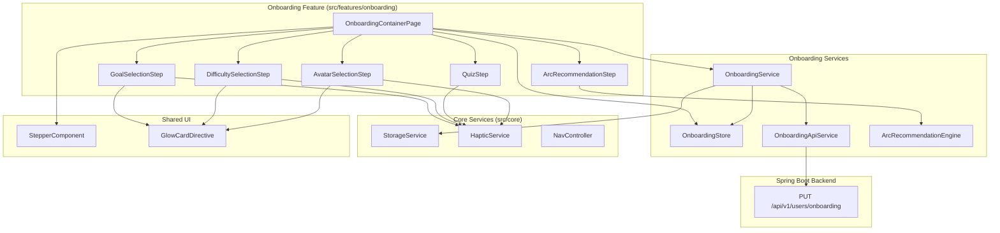
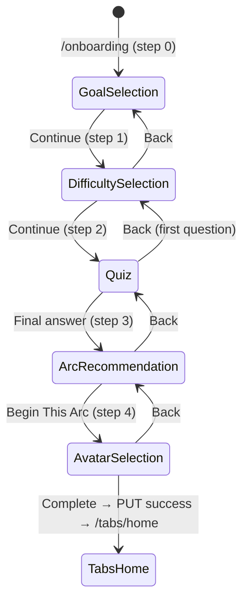
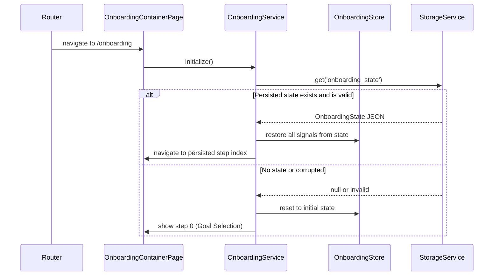
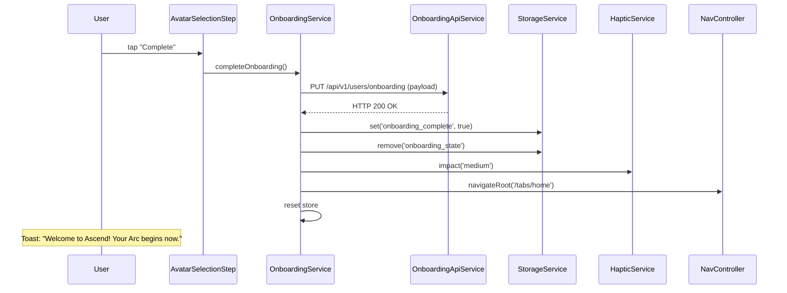

# Design Document: UI Onboarding

## Overview

The UI Onboarding feature implements the multi-step personalization wizard that new users complete after authentication. It guides users through 5 sequential screens — Goal Selection, Difficulty Selection, Personality Quiz, Arc Recommendation, and Avatar Selection — collecting preferences that shape their Ascend experience. The flow persists progress locally via Capacitor Preferences so users can resume mid-flow after app closure.

### Design Goals

- **Signal-driven state**: All onboarding state managed via Angular signals in a centralized `OnboardingStore`, enabling glitch-free reactivity across steps.
- **Persistence-first**: Every step advancement persists state to Capacitor Preferences via `StorageService`, ensuring no progress is lost on app closure.
- **Deterministic recommendations**: The Arc recommendation algorithm is a pure function of goals + difficulty + personality type, producing consistent results for the same inputs.
- **Game-like UX**: Neon glow effects, haptic feedback, and smooth transitions create an engaging first impression consistent with the app's dark/neon aesthetic.
- **Lazy-loaded isolation**: The entire onboarding feature is a single lazy chunk, loaded only for users who haven't completed onboarding.

## Architecture



### Navigation Flow



### Onboarding Initialization Sequence



### Completion Sequence



## Components and Interfaces

### Pages (Smart Components)

| Component | Selector | Responsibility |
|-----------|----------|---------------|
| `OnboardingContainerPage` | `app-onboarding` | Orchestrates step navigation, renders stepper, manages slide transitions |
| `GoalSelectionStep` | `app-goal-selection` | Displays 6 goal cards, handles multi-select (1–3), emits selection changes |
| `DifficultySelectionStep` | `app-difficulty-selection` | Displays 3 difficulty tiers, handles single-select, emits selection |
| `QuizStep` | `app-quiz` | Presents sequential questions, handles answer selection, computes personality type |
| `ArcRecommendationStep` | `app-arc-recommendation` | Shows recommended Arc, handles override selection, emits final Arc choice |
| `AvatarSelectionStep` | `app-avatar-selection` | Displays avatar grid, handles single-select, triggers completion flow |

### Shared UI Components

| Component | Selector | Responsibility |
|-----------|----------|---------------|
| `StepperComponent` | `app-stepper` | Visual progress indicator (5 dots/segments) with current step highlighting |
| `GlowCardDirective` | `[appGlowCard]` | Applies neon glow CSS effect on selection with configurable color |

### OnboardingStore

```typescript
@Injectable({ providedIn: 'root' })
export class OnboardingStore {
  // --- Writable Signals (internal) ---
  private readonly _currentStep = signal<number>(0);
  private readonly _selectedGoals = signal<string[]>([]);
  private readonly _selectedDifficulty = signal<string | null>(null);
  private readonly _quizAnswers = signal<QuizAnswer[]>([]);
  private readonly _personalityType = signal<string | null>(null);
  private readonly _selectedArc = signal<string | null>(null);
  private readonly _selectedAvatar = signal<string | null>(null);

  // --- Public Readonly Signals ---
  readonly currentStep: Signal<number> = this._currentStep.asReadonly();
  readonly selectedGoals: Signal<string[]> = this._selectedGoals.asReadonly();
  readonly selectedDifficulty: Signal<string | null> = this._selectedDifficulty.asReadonly();
  readonly quizAnswers: Signal<QuizAnswer[]> = this._quizAnswers.asReadonly();
  readonly personalityType: Signal<string | null> = this._personalityType.asReadonly();
  readonly selectedArc: Signal<string | null> = this._selectedArc.asReadonly();
  readonly selectedAvatar: Signal<string | null> = this._selectedAvatar.asReadonly();

  // --- Computed Signals ---
  readonly isStepValid: Signal<boolean> = computed(() => {
    switch (this._currentStep()) {
      case 0: return this._selectedGoals().length >= 1 && this._selectedGoals().length <= 3;
      case 1: return this._selectedDifficulty() !== null;
      case 2: return this._quizAnswers().length === TOTAL_QUIZ_QUESTIONS;
      case 3: return this._selectedArc() !== null;
      case 4: return this._selectedAvatar() !== null;
      default: return false;
    }
  });

  // --- Mutators (called by OnboardingService) ---
  setCurrentStep(step: number): void { this._currentStep.set(step); }
  setGoals(goals: string[]): void { this._selectedGoals.set(goals); }
  setDifficulty(tier: string | null): void { this._selectedDifficulty.set(tier); }
  setQuizAnswers(answers: QuizAnswer[]): void { this._quizAnswers.set(answers); }
  setPersonalityType(type: string | null): void { this._personalityType.set(type); }
  setArc(arcId: string | null): void { this._selectedArc.set(arcId); }
  setAvatar(avatarId: string | null): void { this._selectedAvatar.set(avatarId); }

  /** Returns a plain object snapshot for serialization. */
  getSnapshot(): OnboardingState {
    return {
      currentStep: this._currentStep(),
      selectedGoals: this._selectedGoals(),
      selectedDifficulty: this._selectedDifficulty(),
      quizAnswers: this._quizAnswers(),
      personalityType: this._personalityType(),
      selectedArc: this._selectedArc(),
      selectedAvatar: this._selectedAvatar(),
    };
  }

  /** Restores state from a validated snapshot. */
  restore(state: OnboardingState): void {
    this._currentStep.set(state.currentStep);
    this._selectedGoals.set(state.selectedGoals);
    this._selectedDifficulty.set(state.selectedDifficulty);
    this._quizAnswers.set(state.quizAnswers);
    this._personalityType.set(state.personalityType);
    this._selectedArc.set(state.selectedArc);
    this._selectedAvatar.set(state.selectedAvatar);
  }

  /** Resets all signals to initial state. */
  reset(): void {
    this._currentStep.set(0);
    this._selectedGoals.set([]);
    this._selectedDifficulty.set(null);
    this._quizAnswers.set([]);
    this._personalityType.set(null);
    this._selectedArc.set(null);
    this._selectedAvatar.set(null);
  }
}
```

### OnboardingService

```typescript
@Injectable({ providedIn: 'root' })
export class OnboardingService {
  private readonly store = inject(OnboardingStore);
  private readonly storage = inject(StorageService);
  private readonly api = inject(OnboardingApiService);
  private readonly haptic = inject(HapticService);
  private readonly navCtrl = inject(NavController);

  private static readonly STORAGE_KEY = 'onboarding_state';

  /** Initializes onboarding: restores persisted state or starts fresh. */
  async initialize(): Promise<void>;

  /** Advances to the next step and persists state. */
  advanceStep(): void;

  /** Goes back to the previous step and persists state. */
  goBack(): void;

  /** Updates selected goals (1–3 items) and persists. */
  setGoals(goals: string[]): void;

  /** Updates selected difficulty tier and persists. */
  setDifficulty(tier: string): void;

  /** Adds a quiz answer, computes personality type if final answer. */
  addQuizAnswer(answer: QuizAnswer): void;

  /** Sets the selected Arc (recommendation or override). */
  setArc(arcId: string): void;

  /** Sets the selected avatar. */
  setAvatar(avatarId: string): void;

  /** Submits onboarding payload to backend, handles success/failure. */
  completeOnboarding(): Observable<void>;

  /** Resets store and clears persisted state. */
  reset(): void;

  /** Persists current store snapshot to Capacitor Preferences. */
  private persistState(): Promise<void>;

  /** Validates a deserialized state object. Returns null if invalid. */
  private validateState(raw: unknown): OnboardingState | null;
}
```

**Key behaviors:**
- `initialize()` reads from `StorageService.get('onboarding_state')`, validates the structure, and either restores or starts fresh.
- Every setter method calls `persistState()` after updating the store.
- `completeOnboarding()` returns an Observable that emits on success or errors on failure. The calling component subscribes and handles UI state (loading spinner, error display).
- `validateState()` checks: `currentStep` is 0–4, `selectedGoals` is array of 0–3 strings, all other fields are string|null or valid arrays.

### OnboardingApiService

```typescript
@Injectable({ providedIn: 'root' })
export class OnboardingApiService {
  private readonly http = inject(HttpClient);
  private readonly apiUrl = inject(API_URL);

  /** Submits the complete onboarding payload to the backend. */
  submitOnboarding(payload: OnboardingPayload): Observable<void> {
    return this.http.put<void>(`${this.apiUrl}/users/onboarding`, payload);
  }
}
```

### ArcRecommendationEngine

```typescript
/**
 * Pure function that computes the recommended Arc based on user inputs.
 * Deterministic: same inputs always produce the same output.
 */
export function computeRecommendedArc(
  goals: string[],
  difficulty: string,
  personalityType: string
): string;
```

**Algorithm overview:**
1. Each goal maps to a set of Arc affinities (weighted scores).
2. The difficulty tier applies a multiplier to certain Arcs (e.g., Beast Mode boosts Warrior/Beast Mode Arcs).
3. The personality type adds a final bias toward compatible Arcs.
4. The Arc with the highest combined score wins. Ties broken by a fixed priority order.

### Route Configuration

```typescript
// src/features/onboarding/onboarding.routes.ts
export const ONBOARDING_ROUTES: Routes = [
  {
    path: '',
    loadComponent: () =>
      import('./pages/onboarding-container/onboarding-container.page')
        .then(m => m.OnboardingContainerPage),
  },
];
```

The container page manages step navigation internally using signals and `@switch` / `@if` blocks rather than child routes. This avoids URL changes per step (the URL stays at `/onboarding`) and simplifies state management and slide animations.

### StepperComponent

```typescript
@Component({
  standalone: true,
  selector: 'app-stepper',
  template: `...`,
})
export class StepperComponent {
  @Input({ required: true }) totalSteps!: number;
  @Input({ required: true }) currentStep!: number;
}
```

Renders filled dots for completed steps, a pulsing glow dot for the current step, and muted dots for upcoming steps.

### GlowCardDirective

```typescript
@Directive({
  standalone: true,
  selector: '[appGlowCard]',
})
export class GlowCardDirective {
  @Input() appGlowCard: boolean = false;          // Whether glow is active
  @Input() glowColor: string = '#FF9800';         // Glow color (default: primary accent)
  @Input() glowRadius: string = '12px';           // Glow spread radius
}
```

Applies/removes CSS `box-shadow` and `border-color` based on the `appGlowCard` boolean input. Includes the 200ms ease-in transition and 0.97 scale press feedback.

## Data Models

### OnboardingState (Persistence Model)

```typescript
export interface OnboardingState {
  currentStep: number;              // 0–4
  selectedGoals: string[];          // 0–3 goal identifiers
  selectedDifficulty: string | null;
  quizAnswers: QuizAnswer[];
  personalityType: string | null;
  selectedArc: string | null;
  selectedAvatar: string | null;
}
```

### QuizAnswer

```typescript
export interface QuizAnswer {
  questionId: string;
  selectedOptionId: string;
}
```

### QuizQuestion

```typescript
export interface QuizQuestion {
  id: string;
  text: string;
  options: QuizOption[];
  dimension: PersonalityDimension;
}

export interface QuizOption {
  id: string;
  text: string;
  weight: Record<string, number>; // Maps personality trait → score contribution
}

export type PersonalityDimension =
  | 'discipline_style'
  | 'motivation_triggers'
  | 'challenge_type'
  | 'time_availability';
```

### GoalCategory

```typescript
export interface GoalCategory {
  id: string;
  name: string;
  description: string;
  icon: string;           // Ionicon name or emoji
}

export const GOAL_CATEGORIES: GoalCategory[] = [
  { id: 'fitness', name: 'Fitness', description: 'Build strength and endurance', icon: 'barbell-outline' },
  { id: 'career', name: 'Career', description: 'Level up professionally', icon: 'briefcase-outline' },
  { id: 'mindfulness', name: 'Mindfulness', description: 'Find inner peace and focus', icon: 'leaf-outline' },
  { id: 'relationships', name: 'Relationships', description: 'Deepen your connections', icon: 'people-outline' },
  { id: 'finance', name: 'Finance', description: 'Master your money', icon: 'wallet-outline' },
  { id: 'learning', name: 'Learning', description: 'Expand your knowledge', icon: 'book-outline' },
];
```

### DifficultyTier

```typescript
export interface DifficultyTier {
  id: string;
  name: string;
  subtitle: string;
  flameCount: number;     // 1, 2, or 3
  recommended: boolean;
  glowColor: string;      // CSS color for glow effect
}

export const DIFFICULTY_TIERS: DifficultyTier[] = [
  { id: 'casual', name: 'Casual', subtitle: 'Easy pace, gentle reminders', flameCount: 1, recommended: false, glowColor: '#FF9800' },
  { id: 'balanced', name: 'Balanced', subtitle: 'Moderate challenge, steady growth', flameCount: 2, recommended: true, glowColor: '#FF9800' },
  { id: 'beast_mode', name: 'Beast Mode', subtitle: 'Intense discipline, maximum results', flameCount: 3, recommended: false, glowColor: '#F44336' },
];
```

### ArcDefinition

```typescript
export interface ArcDefinition {
  id: string;
  name: string;
  description: string;
  themeColor: string;
  sampleQuests: string[];
  icon: string;
}

export const AVAILABLE_ARCS: ArcDefinition[] = [
  { id: 'monk', name: 'The Monk', description: 'Master discipline through mindfulness and routine', themeColor: '#4CAF50', sampleQuests: ['Morning meditation', 'Digital detox hour', 'Gratitude journal', 'Breathwork session'], icon: 'leaf-outline' },
  { id: 'warrior', name: 'The Warrior', description: 'Conquer challenges through physical and mental strength', themeColor: '#F44336', sampleQuests: ['Cold shower challenge', '100 pushups', 'Run 5K', 'No excuses day'], icon: 'shield-outline' },
  { id: 'scholar', name: 'The Scholar', description: 'Grow through knowledge and intellectual pursuit', themeColor: '#2196F3', sampleQuests: ['Read 30 pages', 'Learn a new skill', 'Teach someone', 'Deep work block'], icon: 'book-outline' },
  { id: 'creator', name: 'The Creator', description: 'Build and express through creative output', themeColor: '#9C27B0', sampleQuests: ['Create something new', 'Share your work', 'Brainstorm 10 ideas', 'Ship a project'], icon: 'color-palette-outline' },
  { id: 'beast', name: 'Beast Mode', description: 'Push every limit with relentless intensity', themeColor: '#FF5722', sampleQuests: ['5AM wake-up', 'Double workout', 'Zero cheat meals', 'Outwork everyone'], icon: 'flame-outline' },
];
```

### AvatarOption

```typescript
export interface AvatarOption {
  id: string;
  name: string;
  imageUrl: string;
}
```

### OnboardingPayload (Backend Submission)

```typescript
export interface OnboardingPayload {
  selectedGoals: string[];
  difficulty: string;
  personalityType: string;
  selectedArc: string;
  selectedAvatar: string;
}
```

### Validation Constants

```typescript
export const ONBOARDING_CONSTANTS = {
  TOTAL_STEPS: 5,
  MIN_GOALS: 1,
  MAX_GOALS: 3,
  MIN_STEP: 0,
  MAX_STEP: 4,
  QUIZ_QUESTION_COUNT: 6,
  TRANSITION_DURATION_MS: 300,
  QUIZ_AUTO_ADVANCE_DELAY_MS: 400,
  GLOW_TRANSITION_MS: 200,
  PRESS_SCALE_DURATION_MS: 100,
} as const;
```


## Correctness Properties

*A property is a characteristic or behavior that should hold true across all valid executions of a system — essentially, a formal statement about what the system should do. Properties serve as the bridge between human-readable specifications and machine-verifiable correctness guarantees.*

### Property 1: Step navigation preserves invariants

*For any* valid onboarding state with `currentStep` in range [0, 4], calling `advanceStep()` when `currentStep < 4` SHALL result in `currentStep` incrementing by exactly 1 while all other state fields (selectedGoals, selectedDifficulty, quizAnswers, personalityType, selectedArc, selectedAvatar) remain unchanged. Calling `goBack()` when `currentStep > 0` SHALL result in `currentStep` decrementing by exactly 1 while all other state fields remain unchanged.

**Validates: Requirements 1.3, 1.4**

### Property 2: isStepValid reflects step-specific criteria

*For any* combination of step index (0–4) and onboarding state values, the `isStepValid` computed signal SHALL return `true` if and only if: step 0 has 1–3 goals selected, step 1 has a non-null difficulty, step 2 has all quiz questions answered, step 3 has a non-null selectedArc, and step 4 has a non-null selectedAvatar. For all other states, it SHALL return `false`.

**Validates: Requirements 1.5, 2.8, 3.7, 6.6, 9.2**

### Property 3: Goal selection enforces 1–3 bounds

*For any* sequence of goal toggle operations (select/deselect), the `selectedGoals` array SHALL never contain more than 3 elements. When the array already contains 3 elements, attempting to add a fourth goal SHALL be rejected (array remains unchanged). When the array contains 1–3 elements, removing a goal SHALL always succeed.

**Validates: Requirements 2.4, 2.5, 2.6**

### Property 4: Single-select fields always equal last selection

*For any* sequence of selection operations on a single-select field (difficulty tier or avatar), the signal value SHALL always equal the identifier of the most recently selected item. Selecting a new item SHALL replace the previous value, never accumulate.

**Validates: Requirements 3.4, 6.3**

### Property 5: Personality type computation is deterministic

*For any* valid set of quiz answers (one answer per question, all questions answered), the `computePersonalityType` function SHALL always produce the same personality type string when given the same input answers, regardless of when or how many times it is called.

**Validates: Requirements 4.6, 4.7**

### Property 6: Arc recommendation produces a valid Arc from available set

*For any* valid combination of selected goals (1–3 from the 6 categories), difficulty tier (casual/balanced/beast_mode), and personality type, the `computeRecommendedArc` function SHALL return an Arc identifier that exists in the `AVAILABLE_ARCS` array. The function SHALL never return null, undefined, or an identifier not in the available set.

**Validates: Requirements 5.2**

### Property 7: Onboarding state serialization round-trip

*For any* valid `OnboardingState` object (currentStep 0–4, selectedGoals array of 0–3 strings, selectedDifficulty string or null, quizAnswers array of valid QuizAnswer objects, personalityType string or null, selectedArc string or null, selectedAvatar string or null), serializing with `JSON.stringify` then deserializing with `JSON.parse` SHALL produce an object deeply equal to the original.

**Validates: Requirements 8.1, 8.2, 12.1, 12.2, 12.3**

### Property 8: State validation correctly rejects invalid structures

*For any* value that does NOT conform to the `OnboardingState` interface constraints (currentStep outside 0–4, selectedGoals not an array or containing more than 3 items, selectedGoals containing non-string elements, or any field having an unexpected type), the `validateState` function SHALL return `null`. For any value that DOES conform to all constraints, it SHALL return the validated `OnboardingState` object.

**Validates: Requirements 8.7, 12.5, 12.6**

## Error Handling

### Onboarding Completion Errors

| Scenario | Handling |
|----------|----------|
| `PUT /api/v1/users/onboarding` returns 5xx | Display inline error: "Could not save your profile. Please try again." with Retry button |
| `PUT /api/v1/users/onboarding` network error | Display inline error: "Could not save your profile. Please try again." with Retry button |
| `PUT /api/v1/users/onboarding` returns 400 (validation) | Display inline error with server message; allow user to go back and fix selections |
| `PUT /api/v1/users/onboarding` returns 401 | Auth interceptor handles — clears session, redirects to `/auth/welcome` |
| Duplicate submission (double-tap) | Prevented by disabling Complete button and showing spinner during request |

### State Persistence Errors

| Scenario | Handling |
|----------|----------|
| `StorageService.set()` fails during persist | Silently handled by StorageService (logs warning); user continues without persistence |
| `StorageService.get()` returns null on initialize | Start onboarding from step 0 (fresh state) |
| Persisted state fails validation | Discard corrupted state, remove key from storage, start from step 0 |
| `JSON.parse` throws on corrupted data | Caught by StorageService; returns null; treated as no persisted state |

### Quiz Errors

| Scenario | Handling |
|----------|----------|
| Quiz questions data missing/empty | Display error state with "Could not load quiz. Please restart onboarding." and a restart button |
| Personality computation returns unexpected value | Fall back to a default personality type; log warning |

### Navigation Errors

| Scenario | Handling |
|----------|----------|
| `advanceStep()` called at step 4 | No-op (guard clause prevents increment beyond max) |
| `goBack()` called at step 0 | No-op (guard clause prevents decrement below 0) |
| User navigates to `/onboarding` after completion | Onboarding guard redirects to `/tabs/home` |
| User navigates to `/onboarding` while unauthenticated | Auth guard redirects to `/auth/welcome` |

### Error Propagation Philosophy

- **OnboardingService**: Catches persistence errors silently (non-critical). Propagates API errors to the calling component via Observable error channel.
- **OnboardingStore**: Never throws — all mutations are synchronous signal updates.
- **OnboardingApiService**: Propagates HTTP errors to OnboardingService; does not handle them.
- **Step Components**: Catch errors from OnboardingService, display inline error UI, never re-throw.
- **Guards**: Never throw — always redirect to a safe route.

## Testing Strategy

### Testing Framework

- **Unit/Integration tests**: Jasmine + Karma (Angular default) with Angular TestBed
- **Property-based tests**: [fast-check](https://github.com/dubzzz/fast-check) for TypeScript
- **Component tests**: Angular TestBed with standalone component harnesses

### Property-Based Testing Configuration

Each property test runs a minimum of **100 iterations** with fast-check's default shrinking enabled.

Each property test is tagged with a comment referencing its design property:
```typescript
// Feature: ui-onboarding, Property 1: Step navigation preserves invariants
```

### Test Categories

#### Smoke Tests (Static Configuration)
- Onboarding routes defined under `/onboarding` with lazy loading (11.1)
- OnboardingStore is `providedIn: 'root'` singleton (9.1)
- OnboardingService is `providedIn: 'root'` singleton (9.3)
- OnboardingService delegates HTTP to OnboardingApiService (9.5)
- Components are standalone with signals (1.6)
- Uses Ionic page components (10.7)
- Dark theme CSS variables applied (10.1, 10.2, 10.3)
- 44px minimum touch targets (10.4)
- Card press feedback CSS (10.6)
- No tab bar rendered during onboarding (11.4)

#### Example-Based Unit Tests
- Onboarding flow renders 5 steps in correct order (1.1)
- First step hides back button (1.7)
- Goal selection displays 6 cards in 2-column grid (2.1)
- Goal card displays icon, name, description (2.7)
- Tapping goal card applies glow effect (2.2)
- Tapping goal card triggers haptic (2.3)
- Deselecting goal removes glow (2.6)
- Difficulty screen displays 3 tier cards (3.1, 3.2)
- Balanced tier shows "Recommended" badge (3.3)
- Beast Mode uses red glow (3.6)
- Tapping difficulty triggers haptic (3.5)
- Quiz presents questions sequentially (4.1, 4.2)
- Answer selection highlights, triggers haptic, auto-advances (4.3)
- Quiz back shows previous answer pre-selected (4.4)
- No Continue button on quiz step (4.8)
- Arc recommendation hero card displays Arc details (5.1)
- "Choose a different Arc" reveals override list (5.4, 5.5)
- Override selection updates store (5.6)
- "Begin This Arc" advances to avatar selection (5.3, 5.7)
- Avatar grid displays 8+ options (6.1)
- Selected avatar shows 128px preview (6.5)
- Avatar tap triggers haptic (6.4)
- Complete button submits payload (6.7)
- Success sets onboarding_complete flag (7.2)
- Success navigates to /tabs/home (7.3)
- Success triggers haptic and toast (7.4)
- Failure shows error with retry (7.5)
- Loading spinner during request (7.6)
- Store reset after completion (7.7)
- Restore navigates to persisted step (8.3)
- No persisted state starts from step 0 (8.4)
- Completion removes onboarding_state key (8.5)
- Stepper shows correct step/total with proper styling (1.2, 10.5)
- Onboarding guard redirects completed users (11.3)
- navigateRoot prevents back-navigation (11.5)

#### Property-Based Tests (8 properties)
- Step navigation preserves invariants (Property 1)
- isStepValid reflects step-specific criteria (Property 2)
- Goal selection enforces 1–3 bounds (Property 3)
- Single-select fields always equal last selection (Property 4)
- Personality type computation is deterministic (Property 5)
- Arc recommendation produces valid Arc (Property 6)
- Onboarding state serialization round-trip (Property 7)
- State validation rejects invalid structures (Property 8)

#### Integration Tests
- Full onboarding flow: goal → difficulty → quiz → arc → avatar → complete
- State persistence: complete partial flow, reinitialize, verify restoration
- Completion API call with mocked HttpClient
- Guard integration: authenticated + incomplete → allows access; authenticated + complete → redirects

### Test File Organization

```
src/features/onboarding/__tests__/
  onboarding-container.page.spec.ts
  goal-selection.step.spec.ts
  difficulty-selection.step.spec.ts
  quiz.step.spec.ts
  arc-recommendation.step.spec.ts
  avatar-selection.step.spec.ts

src/features/onboarding/services/__tests__/
  onboarding.service.spec.ts
  onboarding.service.property.spec.ts
  onboarding.store.spec.ts
  onboarding.store.property.spec.ts
  onboarding-api.service.spec.ts
  arc-recommendation.engine.property.spec.ts

src/features/onboarding/utils/__tests__/
  personality-computation.property.spec.ts
  state-validation.property.spec.ts

src/shared/components/__tests__/
  stepper.component.spec.ts

src/shared/directives/__tests__/
  glow-card.directive.spec.ts
```
